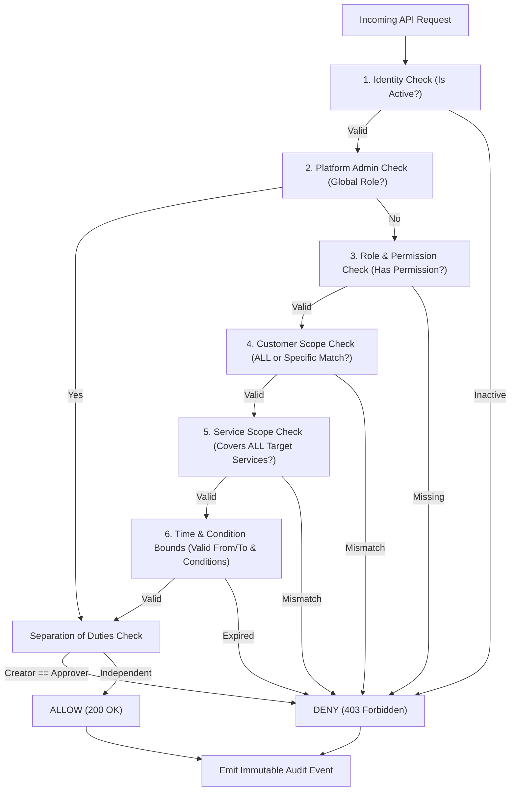
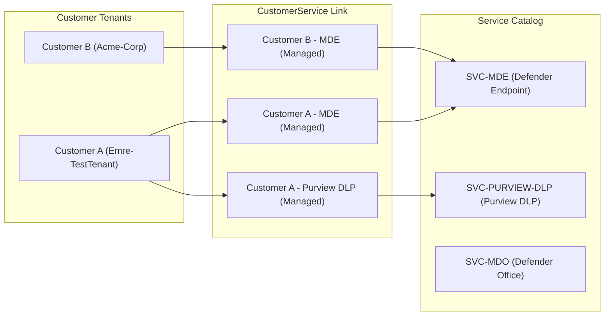
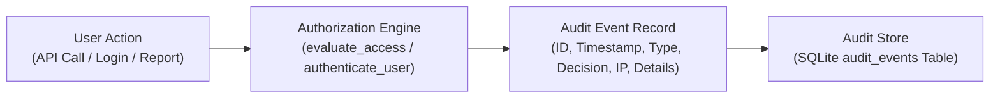
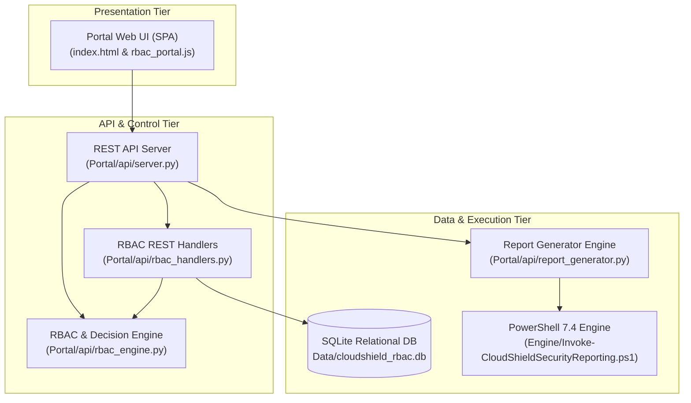

# CloudShield MSSP Platform — Master Architecture Specification

**Current Release Version:** `v2.5.13-PILOT`  
**Classification:** Enterprise System Architecture  
**Runtime Architecture:** Dual-Engine (Python 3.11 Standard Library REST API + PowerShell 7.4 Telemetry Engine)  
**Host Architecture:** Azure Container Apps (Serverless Linux Container)  

---

## 1. CloudShield Overview

**CloudShield** is an enterprise-grade, multi-tenant managed security operations, governance, and executive reporting platform engineered specifically for **KoçSistem Managed Security Service Provider (MSSP)** operations. 

It connects directly to client Microsoft 365 E5, Microsoft Defender XDR, and Microsoft Purview tenants to aggregate raw security telemetry, normalize indicators, enforce mathematical consistency, and produce boardroom-ready executive briefings and actionable remediation backlogs.

---

## 2. Report Product & Design Principles

CloudShield operates as a **100% Dynamic Data Shell**:
- **Zero Static Metrics:** Report templates contain no hardcoded incidents, simulated compliance scores, or hallucinated dollar savings.
- **Missing Data Disclosure:** When sensors or devices are zero, metrics strictly render `N/A`, never `100%` or `0%`.
- **Storytelling Contract:** Every section follows a four-stage cognitive progression:
  $$\text{Evidence} \longrightarrow \text{Meaning} \longrightarrow \text{Risk} \longrightarrow \text{Action}$$
- **Four Executive Quadrants:** All remediation backlog items are categorized into actionable quadrants (*Approved*, *Pending*, *Deferred*, *Recommended*).
- **Executive Readability:** Directly answers the 6 mandatory C-Level questions (*Ne Oldu?*, *Neden Önemli?*, *Microsoft Ne Sağladı?*, *KoçSistem Ne Sağladı?*, *Hangi Riskler Kaldı?*, *Hangi Kararlar Alınmalı?*).

---

## 3. Reporting Pipeline (Required Diagram 1)

The reporting pipeline processes raw cloud events through strict mathematical and privacy gates before rendering:

```mermaid
flowchart LR
    subgraph Stage1 ["1. Telemetry Ingestion"]
        Collector["PowerShell Collector<br/>(Graph & Advanced Hunting)"]
    end

    subgraph Stage2 ["2. Normalization & Privacy"]
        Normalization["Schema Normalization<br/>(data.json)"]
        PrivacyLayer["Privacy Layer<br/>(k-Anonymity & Masking)"]
    end

    subgraph Stage3 ["3. Analytics & Integrity"]
        KpiEngine["KPI Engine<br/>(Mathematical Integrity)"]
        ProvenanceEngine["Provenance Engine<br/>(Catalog Query Mapping)"]
        CollectionHealth["Collection Health<br/>(Sensor State Assessment)"]
    end

    subgraph Stage4 ["4. Quality & Rendering"]
        QualityGate["Semantic Quality Gate<br/>(14 Mandatory Rules)"]
        ReportGenerator["Report Generator<br/>(HTML Template Engine)"]
        Artifacts["Output Artifacts<br/>(A4 Vector PDF & HTML)"]
    end

    Collector --> Normalization
    Normalization --> PrivacyLayer
    PrivacyLayer --> KpiEngine
    KpiEngine --> ProvenanceEngine
    ProvenanceEngine --> CollectionHealth
    CollectionHealth --> QualityGate
    QualityGate --> ReportGenerator
    ReportGenerator --> Artifacts
```

---

## 4. Executive & Technical Reporting

CloudShield delivers tiered reporting artifacts:
1. **Executive Summary (Page 1):** Boardroom-ready scorecard displaying Overall Posture, Verified Incident Suppression, Four-Pillar Value Attribution, and Collection Health Disclosures.
2. **Service Deep Dives (Pages 2–3):** Dedicated technical breakdowns for Microsoft Defender for Endpoint (MDE), Defender for Office (MDO), Defender for Cloud Apps (MDA), and Microsoft Purview DLP/Governance.
3. **M365 E5 Consolidated Briefing:** Multi-service synthesis providing enterprise-wide visibility across endpoint, identity, email, and data governance.

---

## 5. KPI Provenance & Arithmetic Integrity

Every metric displayed in CloudShield is bound to an immutable source:
- **Query Catalog ID:** Every card links to an approved source query (e.g., `QRY-MDE-001`, `QRY-DLP-003`).
- **Zero-Sensor Arithmetic:** Zero sensors and zero devices cannot produce 100% compliance. Missing denominators strictly render `N/A`.
- **Parent-Child Consistency:** Sub-category counts (e.g., DLP rule overrides) must arithmetically sum to parent totals.

---

## 6. Collection Health & Availability

Collector execution status is tracked across 4 standard states:
- `Success`: Full telemetry collected; verified clean states are valid.
- `Partial`: Selected workloads unavailable; partial disclosures rendered.
- `CollectionFailed`: Collector encountered API failure; KPI cards suppressed, explicit warning banner on Page 1.
- `NotLicensed`: Customer has not subscribed to service; section completely hidden or shown as unsubscribed.

---

## 7. Privacy Layer (Privacy-by-Design)

- **k-Anonymity ($k=5$):** User activities with fewer than 5 impacted identities are grouped into aggregate pools to prevent re-identification.
- **Pseudonymization:** User principal names are masked (`a***.y***@domain.com`); sensitive file names are hashed (`Mali_Rapor_***.xlsx`).
- **TLP:AMBER Compliance:** Reports are marked proprietary and strictly bound to customer boundaries.

---

## 8. Customer Decision Framework

Operational backlog items are structured into an actionable four-quadrant instrument:
1. **Approved (Uygulanan):** Approved optimizations implemented by KoçSistem engineering.
2. **Pending (Onay Bekleyen):** Critical policy or rule changes awaiting customer CISO decision.
3. **Deferred (Ertelenen):** Low-priority recommendations postponed for scheduled maintenance.
4. **Recommended (Tavsiye Edilen):** Proactive hardening steps derived from telemetry posture.

---

## 9. Semantic Quality Gates

All generated reports pass an automated 14-rule semantic quality gate (`test_report_quality_gate.py`):
- Rule 1: Zero Sensor/Device Compliance Violation Prevention
- Rule 2: Missing Denominator N/A Enforcement
- Rule 3: DLP Child-Parent Arithmetic Consistency
- Rule 4: Executive vs Service Action Discrepancy Prevention
- Rule 5: 160-Hour Saved Effort / FTE Divisor Validation
- Rule 6: Collection Failure Page 1 Disclosure
- Rule 7: Empty Table Suppression
- Rule 8: Failed Service Section Suppression
- Rule 9: Decision Category Placeholder Row Elimination
- Rule 10: Absolute Compliance Language Prohibition
- Rule 11: Mandatory Legal & Regulatory Disclaimer
- Rule 12: Zero Incident Verification Prerequisite Validation
- Rule 13: Technical Non-Repudiation Wording Accuracy
- Rule 14: Value Attribution Zero-Effort Evidence Link Suppression

---

## 10. Authorization Pipeline (Required Diagram 2)

Access control is governed by an **8-Stage Authorization Decision Chain** (`evaluate_access`):

---

## 11. RBAC Architecture & Roles

The platform implements 6 standard system roles:
1. **PlatformAdmin:** Global administrative oversight across all services and customers.
2. **SecurityEngineer:** Manages MDE, XDR, and identity security operations and report generation.
3. **ComplianceSpecialist:** Governs Purview DLP, classification, and regulatory compliance reporting.
4. **CustomerCISO:** Customer-scoped executive with report viewing, review, and approval authority.
5. **Auditor:** Read-only access to audit trails, assignments, and customer reports.
6. **ServiceOperator:** Tier-1 telemetry monitoring and basic dashboard access.

---

## 12. Customer-Service Matrix (Required Diagram 3)

Subscriptions link customers to licensed security service modules:

---

## 13. Assignment Engine

- Supports direct `User` and team-based `Team` assignments.
- Enforces two-dimensional scoping: `CustomerScope` (`ALL` | `Specific`) and `ServiceScope` (`ALL` | `Specific`).
- Time-bounded assignments feature automatic expiration via `valid_to` timestamps.
- Explicit revocation via `DELETE /api/rbac/assignments/{id}` sets `is_active = 0`.

---

## 14. Approval Engine (PIM Workflow)

- Allows temporary privilege escalation requests for emergency incidents.
- Mandates explicit business justification and requested duration (hours).
- Enforces **Separation of Duties (SoD)**: The requesting user is strictly forbidden from approving their own request.
- Approver grant automatically generates a temporary, time-bounded `access_assignments` record.

---

## 15. Audit Architecture (Required Diagram 5)

Every authorization decision and administrative action emits a structured audit event:

- **Application-Tier Append-Only:** Only `INSERT INTO audit_events` statements are executed.
- **Storage Status:** Stored locally in `Data/cloudshield_rbac.db`; external SIEM streaming is identified as a production prerequisite.

---

## 16. Portal Architecture (Required Diagram 4)

The end-to-end component topology connects the browser UI to the underlying engines:

---

## 17. Deployment Architecture

- **Host Platform:** Azure Container Apps (Serverless Linux Container).
- **Port:** Primary `8080` (Standard HTTP).
- **Container Base:** PowerShell 7.4 + Python 3.11 + Headless Chromium.
- **Dynamic Azure Discovery:** Zero hardcoded resource groups or container app names; auto-discovered via `Azure/deploy_aca.py`.
- **Single Source Versioning:** Governed by repository root `version.json`.

---

## 18. Controlled Pilot Scope

The current implementation is validated for **Controlled Pilot**:
- **Included & Validated:**
  - Live Graph and MDE Advanced Hunting telemetry pipelines.
  - 100% dynamic report generation and 14 semantic quality gates.
  - 8-stage server-side authorization decision chain and customer/service isolation.
  - Separation of Duties (SoD) on reports and PIM approvals.
  - 11-view RBAC administration portal and interactive decision simulator.
- **Identified Production Blockers (Changes Required for General Production):**
  - Live Microsoft Entra ID OIDC / PKCE authentication with enforceable MFA.
  - Real-time audit log streaming to Microsoft Sentinel / Azure Log Analytics.
