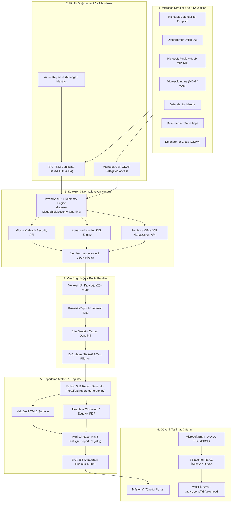

# Sistem Mimarisi ve Teknik Şartname (ARCHITECTURE.md)
## CloudShield Security Reporting & Managed Services Visibility Platform

**Belge Sürümü:** `3.2.0`  
**Sürüm Başlığı:** `v3.2.0-LICENSE-INTELLIGENCE` (Build: 2026.10.09.2)  
**Sınıflandırma:** Kurumsal Sistem Mimarisi ve Güvenlik Spesifikasyonu  
**Durum:** Kontrollü Pilot (Controlled Pilot Architecture)  
**Çalışma Mimarisi:** Çift Motor (Python 3.11 Standart Kütüphane REST API + PowerShell 7.4 Telemetri Motoru)  
**Bulut Altyapısı:** Azure Container Apps (Tek Replika Güvenlik Kilidi: `minReplicas: 1 | maxReplicas: 1`)  
**Kimlik Sağlayıcı:** Microsoft Entra ID (OIDC SSO, PKCE RFC 7636)  

---

## 1. Mimari Genel Bakış ve Temel Prensipler

**CloudShield Security Reporting & Managed Services Visibility Platform**, Microsoft güvenlik ve uyumluluk servislerini (Microsoft Defender ve Microsoft Purview) yönetilen hizmet olarak alan kurumsal müşteriler için aylık raporlama ve yönetilen hizmet görünürlüğü sağlayan özelleşmiş bir platformdur.

```
┌─────────────────────────────────────────────────────────────────────────────┐
│                        TEMEL MİMARİ PRENSİPLER                              │
├──────────────────────────┬──────────────────────────┬───────────────────────┤
│ 1. %100 Dinamik Telemetri│ 2. Fail-Closed Zero Trust│ 3. Sıfır Bilet / CR   │
│    Sıfır sentetik çarpan,│    Varsayılan red, OIDC  │    Manuel operasyonel │
│    eksik veride şeffaf   │    PKCE, üretimde yerel  │    kayıt yok; denetim │
│    N/A bildirimi         │    parola engeli         │    kütüğünden türetme │
├──────────────────────────┼──────────────────────────┼───────────────────────┤
│ 4. Doğrulanmış Provenance│ 5. Katı Kiracı İzolasyonu│ 6. Tek Replika Kilidi │
│    Her KPI için KQL/API  │    Müşteriler arası veri │    SQLite bozulmasını │
│    kaynağı ve SHA-256    │    sızması imkansız      │    önleyen fail-closed│
│    kriptografik mühür    │    (403 Forbidden)       │    MAX_REPLICAS=1     │
└──────────────────────────┴──────────────────────────┴───────────────────────┘
```

---

## 2. Uçtan Uca Raporlama ve Telemetri Akışı

Aşağıdaki Mermaid diyagramı, Microsoft kiracılarından başlayan telemetri akışının rapor üretimine ve güvenli teslimata kadar olan tüm evrelerini göstermektedir:


```mermaid
flowchart TD
    subgraph Sources ["1. Microsoft Kiracısı & Veri Kaynakları"]
        MDE["Microsoft Defender for Endpoint"]
        MDO["Defender for Office 365"]
        PRV["Microsoft Purview (DLP, MIP, SIT)"]
        INT["Microsoft Intune (MDM / MAM)"]
        MDI["Defender for Identity"]
        MDCA["Defender for Cloud Apps"]
        MDC["Defender for Cloud (CSPM)"]
    end

    subgraph Auth ["2. Kimlik Doğrulama & Yetkilendirme"]
        CBA["RFC 7523 Certificate-Based Auth (CBA)"]
        GDAP["Microsoft CSP GDAP Delegated Access"]
        Vault["Azure Key Vault (Managed Identity)"]
    end

    subgraph Ingestion ["3. Kolektör & Normalizasyon Motoru"]
        PSMotor["PowerShell 7.4 Telemetry Engine<br/>(Invoke-CloudShieldSecurityReporting)"]
        GraphAPI["Microsoft Graph Security API"]
        KQLHunt["Advanced Hunting KQL Engine"]
        AuditAPI["Purview / Office 365 Management API"]
        Normalize["Veri Normalizasyonu & JSON Fikstür"]
    end

    subgraph Quality ["4. Veri Doğruluğu & Kalite Kapıları"]
        Catalog["Merkezi KPI Kataloğu (23+ Alan)"]
        Reconciliation["Kolektör-Rapor Mutabakat Testi"]
        ZeroMultiplier["Sıfır Sentetik Çarpan Denetimi"]
        Watermark["Doğrulama Statüsü & Test Filigranı"]
    end

    subgraph Generation ["5. Raporlama Motoru & Registry"]
        RepGen["Python 3.11 Report Generator<br/>(Portal/api/report_generator.py)"]
        HTMLOut["Vektörel HTML5 Şablonu"]
        PDFOut["Headless Chromium / Edge A4 PDF"]
        Registry["Merkezi Rapor Kayıt Kütüğü (Report Registry)"]
        Seal["SHA-256 Kriptografik Bütünlük Mührü"]
    end

    subgraph Delivery ["6. Güvenli Teslimat & Sunum"]
        EntraSSO["Microsoft Entra ID OIDC SSO (PKCE)"]
        RBAC["8 Kademeli RBAC İzolasyon Duvarı"]
        PortalUI["Müşteri & Yönetici Portalı"]
        SecureDownload["Yetkili İndirme: /api/reports/{id}/download"]
    end

    Sources --> CBA & GDAP
    Vault --> CBA
    CBA & GDAP --> PSMotor
    PSMotor --> GraphAPI & KQLHunt & AuditAPI
    GraphAPI & KQLHunt & AuditAPI --> Normalize
    Normalize --> Catalog --> Reconciliation --> ZeroMultiplier --> Watermark
    Watermark --> RepGen
    RepGen --> HTMLOut & PDFOut
    HTMLOut & PDFOut --> Registry --> Seal
    Seal --> PortalUI
    EntraSSO --> RBAC --> SecureDownload
```

---

## 3. Güvenlik ve İzolasyon Mimarisi

1. **Katı Kiracı İzolasyonu:**
   - Her API çağrısında `customer_id` oturum token'ı ile doğrulanır.
   - `CustomerViewer` rolündeki kullanıcı yalnızca kendi kurumuna ait raporları görebilir; diğer müşterilere ait `report_id` talepleri fail-closed olarak `403 Forbidden` ile reddedilir.
2. **Kayıt Defteri Tabanlı Rapor İndirme (Registry-Backed Download):**
   - Dosya sistemi doğrudan istemciye açılmaz. İndirmeler merkezi SQLite tablosundaki doğrulanmış `report_id` üzerinden salt okunur akışla sunulur (`/api/reports/{id}/download`).
   - Eski ve güvensiz dosya yolu ile indirme uç noktası `410 Gone` ile emekliye ayrılmıştır.
3. **Tek Replika SQLite Koruması:**
   - Container başlatılırken `verify_replica_safety()` fonksiyonu ortamdaki `MAX_REPLICAS` değişkenini denetler. 1'den büyük değerlerde veritabanı kilitlenme ve sayfa bozulması riskine karşı sistem çalışmayı durdurur.

---

## 4. Hedef Üretim Mimarisi Yol Haritası (Roadmap)

- **Veri Katmanı:** SQLite'tan **Azure Database for PostgreSQL (Flexible Server)**'a geçiş.
- **Önbellek & Hız Sınırı:** Bellek içi sayaçtan **Azure Cache for Redis**'e geçiş.
- **Ağ Güvenliği:** Azure Key Vault ve Container App altyapısının **VNet Entegrasyonu ve Private Endpoint** arkasına alınması.

---

## 5. Lisans Zekâsı ve Güvenlik Değer Gerçekleştirme Modülü (License Intelligence Engine)

Sürüm 3.2.0 ile platforma eklenen bağımsız Lisans Zekâsı modülü, satın alınan Microsoft lisanslarının gerçek güvenlik değeri üretip üretmediğini 5 kademeli zincirde denetler:

```
[1. Hak Sahipliği] ➔ [2. Kullanıcı Ataması] ➔ [3. Servis Planı] ➔ [4. İlke Kapsamı] ➔ [5. Telemetri Kanıtı]
```

### Temel Bileşenler:
1. **5 Katmanlı Mutabakat Motoru (`Portal/api/license_intelligence.py`):** 15 kurumsal iş yükünü 14 kanonik teknik statüyle etiketler.
2. **Resmi Katalog ve CDN İzleyicisi (`Portal/api/license_catalog_updater.py`):** Microsoft Enterprise ve SMB karşılaştırma PDF dokümanlarını periyodik olarak SHA-256 hash kontrolleriyle izler.
3. **Persona ve Hijyen Denetçisi:** Yönetici, Finans, İK, Admin ve Ön Hat profilleri bazında gereksiz atamaları, mükerrer hakları (E5+E3, E5+E5 Sec), ön koşulsuz eklentileri ve pasif kullanıcıları tespit eder.
4. **Azure Tüketim Modeli İzolasyonu:** Defender for Cloud sunucu/bulut kaynaklarını kullanıcı koltuk modelinden ayrıştırarak raporlar.
5. **Veritabanı Katmanı (Migrasyon 005):** `tenant_license_inventory`, `tenant_user_license_profiles`, `license_value_realization_summary`, `workload_license_reconciliation` ve `license_snapshots` tabloları.
6. **20 Bölümlü Sağlık Raporu (`Portal/api/license_report_generator.py`):** Yönetici ve mühendislik seviyesinde HTML ve vektörel A4 PDF çıktıları üretir.

