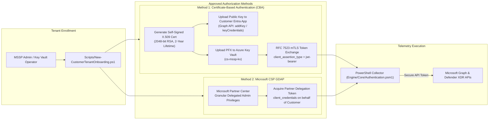
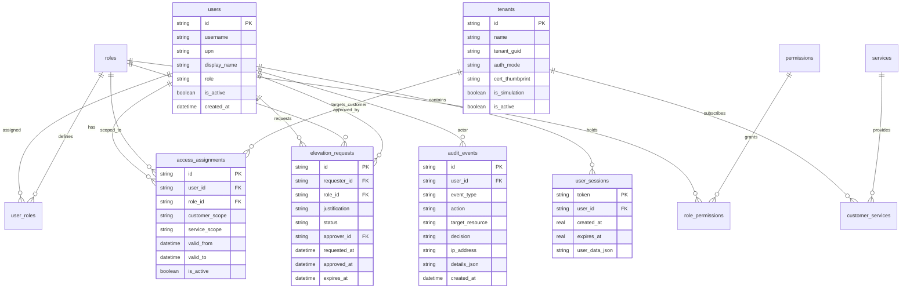
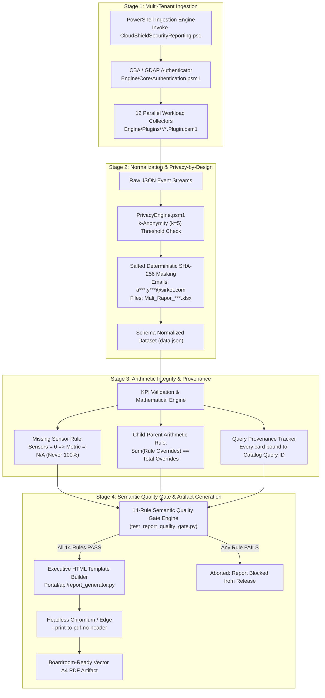

# CloudShield Enterprise MSSP Platform — Master Architecture Specification

**Document Version:** `2.5.15`  
**Classification:** Enterprise System Architecture & Security Specification  
**Platform Status:** Controlled Pilot & Production Release Candidate  
**Runtime Architecture:** Dual-Engine (Python 3.11 Standard Library REST API + PowerShell 7.4 Telemetry Engine)  
**Cloud Hosting Altyapısı:** Azure Container Apps (ACA Serverless Linux Container, Autoscaled Replicas 1–3)  
**Kalıcı Depolama:** Azure Storage File Share Mount (`cloudshield-data` on `/app/Data`)  
**Kimlik Sağlayıcı:** Microsoft Entra ID (OIDC SSO with PKCE & Strict Pre-Enrollment)  
**Müşteri Yetkilendirme Standartı:** Certificate-Based Authentication (RFC 7523 X.509 CBA) & Microsoft CSP GDAP  

---

## 1. Executive Summary & Design Principles

**CloudShield Enterprise MSSP Platform**, Microsoft bulut ekosisteminde (Microsoft Defender XDR ve Microsoft Purview) yönetilen güvenlik ve uyum hizmetleri sunan kurumsal servis sağlayıcılar (MSSP) için geliştirilmiş çok kiracılı (multi-tenant) bir güvenlik orkestrasyonu, yetki yönetişimi ve C-Level raporlama platformudur.

Platform, **Sıfır Güven (Zero Trust)** ve **Tasarımda Gizlilik (Privacy-by-Design)** prensipleri doğrultusunda inşa edilmiştir:

```
┌─────────────────────────────────────────────────────────────────────────────┐
│                       CORE ARCHITECTURAL PRINCIPLES                         │
├──────────────────────────┬──────────────────────────┬───────────────────────┤
│ 1. 100% Dynamic Telemetry│ 2. Fail-Closed Zero Trust│ 3. Privacy-by-Design  │
│    Zero static / mock    │    Deny-by-default, strict│    k-Anonymity (k=5), │
│    metrics; all cards    │    Entra ID SSO, no local │    salted SHA-256     │
│    traceable to live KQL │    passwords in pilot/prod│    masking of PII     │
├──────────────────────────┼──────────────────────────┼───────────────────────┤
│ 4. Provenance & Integrity│ 5. Separation of Duties  │ 6. Durable Volume     │
│    Missing sensors render│    Independent review    │    Azure File Share   │
│    N/A, never 100% or 0%;│    for reports and JIT    │    mount guarantees   │
│    14 semantic rules     │    elevation requests    │    data persistence   │
└──────────────────────────┴──────────────────────────┴───────────────────────┘
```

---

## 2. End-to-End Enterprise Architecture

The following diagram illustrates the complete end-to-end system topology across identity, ingress, API orchestration, durable storage, and multi-tenant customer workloads:

```mermaid
flowchart TD
    subgraph ClientTier ["1. Presentation & Operator Tier"]
        Browser["Modern Browser (Web SPA)<br/>Tailwind CSS + Vanilla JS + Lucide"]
        Mobile["Mobile & Tablet Responsive View"]
    end

    subgraph IdentityTier ["2. Enterprise Identity & SSO"]
        EntraID["Microsoft Entra ID Tenant<br/>(OAuth 2.0 / OIDC Authorization Code + PKCE)"]
        EnterpriseApp["Azure Enterprise Application<br/>Assignment Required: YES"]
        PreEnrollCheck["Zero Trust Pre-Enrollment Gate<br/>UPN Whitelist & User Active Verification"]
    end

    subgraph ACATier ["3. Azure Container Apps Ingress & Processing"]
        Env["ACA Environment: cs-mssp-poc-env<br/>westeurope (Consumption Tier)"]
        ScaleRule["Autoscaling Engine<br/>minReplicas: 1 | maxReplicas: 3"]
        
        subgraph ContainerApp ["Container: cs-mssp-poc-app (Port 8080)"]
            APIServer["Python 3.11 REST Gateway<br/>Portal/api/server.py"]
            AuthMiddleware["Auth Gate & Session Cookie Manager<br/>HttpOnly, Secure, SameSite=Lax"]
            RBACDecision["8-Stage RBAC Engine<br/>Portal/api/rbac_engine.py"]
            ReportGen["Executive Report Generator<br/>Portal/api/report_generator.py"]
            QualityGate["14-Rule Semantic Quality Gate<br/>tests/test_report_quality_gate.py"]
            Chromium["Headless Chromium Engine<br/>A4 Vector PDF Print"]
            PSTelemetry["PowerShell 7.4 Collector Engine<br/>Engine/Invoke-CloudShieldSecurityReporting.ps1"]
        end
    end

    subgraph StorageTier ["4. Durable Storage & Secrets Tier"]
        StorageAcct["Azure Storage Account: csmsspqwy6wesa"]
        FileShare[("Azure File Share: cloudshield-data<br/>Mounted at /app/Data")]
        KeyVault["Azure Key Vault: cs-mssp-kv<br/>Managed Identity Access (CBA X.509 Keys)"]
        
        subgraph MountedData ["Persistent Data Files (/app/Data)"]
            SQLiteDB[("SQLite Database<br/>cloudshield_rbac.db")]
            AuthConfig["auth_config.json (OIDC)"]
            TenantsConfig["tenants.json (CBA Specs)"]
            AuditTrail["Append-Only Audit Events"]
        end
    end

    subgraph WorkloadTier ["5. Managed Customer Tenant Workloads (12 Services)"]
        CustA["Customer A (Enterprise Financial)"]
        CustB["Customer B (Healthcare Provider)"]
        CustC["Customer C (Retail & Supply Chain)"]
        
        subgraph SecurityWorkloads ["Microsoft 365 Defender & Purview Services"]
            MDE["SVC-MDE: Defender for Endpoint"]
            MDO["SVC-MDO: Defender for Office 365"]
            MDI["SVC-MDI: Defender for Identity"]
            MDCA["SVC-MDCA: Defender for Cloud Apps"]
            XDR["SVC-XDR: Defender XDR Unified Incidents"]
            PurviewDLP["SVC-PRV-DLP: Purview Data Loss Prevention"]
            PurviewClass["SVC-PRV-CLASS: Information Protection"]
            PurviewGov["SVC-PRV-GOV: Data Lifecycle & Records"]
            PurviewRisk["SVC-PRV-RISK: Insider Risk Management"]
            PurviewAI["SVC-AI-SECURITY: Purview AI Security Hub"]
            Intune["SVC-INTUNE: Microsoft Intune Compliance"]
            EntraGov["SVC-ENTRA-PIM: Entra ID Protection & PIM"]
        end
    end

    Browser & Mobile -->|HTTPS / Port 443| APIServer
    APIServer -->|Redirect /api/auth/entra/authorize| EntraID
    EntraID --> EnterpriseApp
    EnterpriseApp -->|ID Token + Access Token| PreEnrollCheck
    PreEnrollCheck -->|Enrolled User Validated| AuthMiddleware
    AuthMiddleware --> RBACDecision
    RBACDecision <-->|Query Permissions & Scopes| SQLiteDB
    APIServer --> ReportGen
    ReportGen --> PSTelemetry
    PSTelemetry -->|Acquire App Token (RFC 7523)| KeyVault
    PSTelemetry -->|Live Graph & Advanced Hunting KQL| SecurityWorkloads
    SecurityWorkloads --> CustA & CustB & CustC
    PSTelemetry -->|Normalized Telemetry JSON| ReportGen
    ReportGen --> QualityGate
    QualityGate --> Chromium
    Chromium -->|Executive Vector PDF| Browser
    StorageAcct --- FileShare
    FileShare --- MountedData
```

---

## 3. Zero Trust Identity & Access Architecture

CloudShield enforces an uncompromising Zero Trust security posture across all authentication and administrative channels.

```mermaid
sequenceDiagram
    autonumber
    actor User as Security Operator / CISO
    participant Browser as Web Browser (SPA)
    participant Server as CloudShield API (server.py)
    participant Entra as Microsoft Entra ID (OIDC)
    participant DB as SQLite DB (cloudshield_rbac.db)

    User->>Browser: Access https://cs-mssp-poc-app...
    Browser->>Server: GET /api/auth/me (No session)
    Server-->>Browser: 401 Unauthorized (ssoRequired: true)
    
    User->>Browser: Click "Microsoft Entra ID ile Oturum Aç"
    Browser->>Server: GET /api/auth/entra/authorize
    Server-->>Browser: 302 Redirect to login.microsoftonline.com<br/>(state, nonce, client_id, redirect_uri, scope)
    
    Browser->>Entra: Authenticate (Enterprise Credentials + MFA)
    Note over Entra: Validate Enterprise App Assignment<br/>"Assignment Required: YES"
    Entra-->>Browser: 302 Redirect to /api/auth/entra/callback?code=...&state=...
    
    Browser->>Server: GET /api/auth/entra/callback?code=...
    Server->>Entra: POST /token (Exchange code for ID/Access Token)
    Entra-->>Server: Token Response (id_token with upn/email claims)
    
    Server->>Server: Validate token signature & claims (nonce, aud, exp)
    Server->>DB: Lookup UPN in users table (Must exist & is_active = 1)
    
    alt User is Pre-Enrolled & Active
        Server->>DB: INSERT INTO user_sessions (token, user_id, expires_at)
        Server->>DB: INSERT INTO audit_events (AUTH_LOGIN_SUCCESS)
        Server-->>Browser: 302 Found (Set-Cookie: CS_SESSION=... HttpOnly; Secure; SameSite=Lax)
        Browser->>Server: GET /api/auth/me (with Cookie)
        Server-->>Browser: 200 OK (User Profile, Roles, Scopes)
    else User is NOT Pre-Enrolled or Inactive
        Server->>DB: INSERT INTO audit_events (AUTH_LOGIN_DENIED)
        Server-->>Browser: 403 Forbidden ("Bu kurumsal hesap CloudShield sisteminde yetkilendirilmemiştir")
    end
```

### Key Security Controls:
1. **Assignment Required (`assignmentRequired = true`):** Users must be assigned to the CloudShield Enterprise Application in Entra ID before Microsoft will even issue an authorization code.
2. **Pre-Enrollment Whitelist:** Even with a valid Entra ID token, the user's UPN must match an existing, active record in `users` (`caner@cnrctnky.onmicrosoft.com` or other authorized personnel).
3. **Retired Authentication Stubs (`410 Gone`):** The legacy `POST /api/auth/sso` body-injection endpoint and local password endpoints are permanently disabled in production channels.
4. **Deny-by-Default API Gate:** Any API call lacking an active, valid session cookie or Bearer token is immediately rejected with `401 Unauthorized` before processing.

---

## 4. Live Customer Tenant Authorization Standard (CBA & GDAP)

Live production customer tenants cannot and must not be configured with plain client secrets. CloudShield strictly enforces two enterprise-grade authorization patterns:


```mermaid
flowchart LR
    subgraph Enrollment ["Tenant Enrollment"]
        Admin["MSSP Admin / Key Vault Operator"]
        Script["Scripts/New-CustomerTenantOnboarding.ps1"]
    end

    subgraph AuthMethods ["Approved Authorization Methods"]
        direction TB
        subgraph MethodCBA ["Method 1: Certificate-Based Authentication (CBA)"]
            CertGen["Generate Self-Signed X.509 Cert<br/>(2048-bit RSA, 2-Year Lifetime)"]
            GraphKey["Upload Public Key to Customer Entra App<br/>(Graph API: addKey / keyCredentials)"]
            KVSecret["Upload PFX to Azure Key Vault<br/>(cs-mssp-kv)"]
            CBARuntime["RFC 7523 mTLS Token Exchange<br/>client_assertion_type = jwt-bearer"]
            CertGen --> GraphKey
            CertGen --> KVSecret
            KVSecret --> CBARuntime
        end

        subgraph MethodGDAP ["Method 2: Microsoft CSP GDAP"]
            PartnerCenter["Microsoft Partner Center<br/>Granular Delegated Admin Privileges"]
            PartnerToken["Acquire Partner Delegation Token<br/>client_credentials on behalf of Customer"]
            PartnerCenter --> PartnerToken
        end
    end

    subgraph Execution ["Telemetry Execution"]
        Collector["PowerShell Collector (Engine/Core/Authentication.psm1)"]
        MSAPI["Microsoft Graph & Defender XDR APIs"]
    end

    Admin --> Script
    Script --> MethodCBA & MethodGDAP
    CBARuntime --> Collector
    PartnerToken --> Collector
    Collector -->|Secure API Token| MSAPI
```

### Zero Trust Enforcement in API:
- `POST /api/tenants` and `PUT /api/tenants/<id>` inspect `authMode`:
  - If tenant is live (non-sandbox) and `authMode` is `Secret`, the API rejects the request with `400 Bad Request`:
    `"Canlı müşteri kiracıları için 'Secret' yöntemi kabul edilmez. Lütfen Certificate (CBA) veya GDAP seçiniz."`
- `POST /api/tenants/<id>/test` connects using the specified certificate thumbprint or GDAP credentials and returns verified diagnostic reports.

---

## 5. Relational RBAC Database Schema & JIT Elevation Lifecycle

CloudShield implements a normalized relational database schema in SQLite, persisted on Azure File Share storage:


```mermaid
erDiagram
    users ||--o{ user_roles : "assigned"
    roles ||--o{ user_roles : "defines"
    roles ||--o{ role_permissions : "contains"
    permissions ||--o{ role_permissions : "grants"
    
    users ||--o{ access_assignments : "has"
    roles ||--o{ access_assignments : "scoped_to"
    tenants ||--o{ access_assignments : "targets_customer"
    
    tenants ||--o{ customer_services : "subscribes"
    services ||--o{ customer_services : "provides"
    
    users ||--o{ elevation_requests : "requests"
    roles ||--o{ elevation_requests : "requests_role"
    users ||--o{ elevation_requests : "approved_by"
    
    users ||--o{ audit_events : "actor"
    users ||--o{ user_sessions : "holds"

    users {
        string id PK
        string username
        string upn
        string display_name
        string role
        boolean is_active
        datetime created_at
    }

    tenants {
        string id PK
        string name
        string tenant_guid
        string auth_mode
        string cert_thumbprint
        boolean is_simulation
        boolean is_active
    }

    access_assignments {
        string id PK
        string user_id FK
        string role_id FK
        string customer_scope
        string service_scope
        datetime valid_from
        datetime valid_to
        boolean is_active
    }

    elevation_requests {
        string id PK
        string requester_id FK
        string role_id FK
        string justification
        string status
        string approver_id FK
        datetime requested_at
        datetime approved_at
        datetime expires_at
    }

    audit_events {
        string id PK
        string user_id FK
        string event_type
        string action
        string target_resource
        string decision
        string ip_address
        string details_json
        datetime created_at
    }

    user_sessions {
        string token PK
        string user_id FK
        real created_at
        real expires_at
        string user_data_json
    }
```

### The 8-Stage Authorization Chain (`evaluate_access`):
Every API request targeting a protected resource traverses 8 sequential gates:
1. **Identity Gate:** Verifies the user exists, is active, and possesses an unexpired session.
2. **Platform Admin Override:** Global administrators bypass per-service checks, subject to Separation of Duties.
3. **Role & Permission Gate:** Verifies the user or their assigned roles possess the specific permission token (e.g., `reports:generate`).
4. **Customer Scope Gate:** Validates the target tenant against the user's assigned `customer_scope` (`ALL` or matching tenant ID).
5. **Service Scope Gate:** Validates the target security workloads against the user's `service_scope` (`ALL` or matching service ID).
6. **Temporal Validity Gate:** Confirms `valid_from <= NOW <= valid_to`.
7. **Separation of Duties (SoD) Gate:** Confirms the requester is not approving their own request or auditing their own report.
8. **Audit Emission Gate:** Commits an immutable audit record to `audit_events` with request metadata, decision (`ALLOW` / `DENY`), and duration.

---

## 6. Telemetry Ingestion, Analytics & Semantic Quality Gate Pipeline


```mermaid
flowchart TD
    subgraph Stage1 ["Stage 1: Multi-Tenant Ingestion"]
        PSTelemetry["PowerShell Ingestion Engine<br/>Invoke-CloudShieldSecurityReporting.ps1"]
        CBAAuth["CBA / GDAP Authenticator<br/>Engine/Core/Authentication.psm1"]
        PluginExec["12 Parallel Workload Collectors<br/>Engine/Plugins/*/*.Plugin.psm1"]
        
        PSTelemetry --> CBAAuth --> PluginExec
    end

    subgraph Stage2 ["Stage 2: Normalization & Privacy-by-Design"]
        RawEvents["Raw JSON Event Streams"]
        PrivacyEngine["PrivacyEngine.psm1<br/>k-Anonymity (k=5) Threshold Check"]
        Salting["Salted Deterministic SHA-256 Masking<br/>Emails: a***.y***@sirket.com<br/>Files: Mali_Rapor_***.xlsx"]
        NormalizedData["Schema Normalized Dataset (data.json)"]
        
        PluginExec --> RawEvents --> PrivacyEngine --> Salting --> NormalizedData
    end

    subgraph Stage3 ["Stage 3: Arithmetic Integrity & Provenance"]
        KpiEngine["KPI Validation & Mathematical Engine"]
        RuleZeroSensors["Missing Sensor Rule:<br/>Sensors = 0 => Metric = N/A (Never 100%)"]
        RuleParentChild["Child-Parent Arithmetic Rule:<br/>Sum(Rule Overrides) == Total Overrides"]
        ProvenanceTracker["Query Provenance Tracker<br/>Every card bound to Catalog Query ID"]
        
        NormalizedData --> KpiEngine
        KpiEngine --> RuleZeroSensors & RuleParentChild & ProvenanceTracker
    end

    subgraph Stage4 ["Stage 4: Semantic Quality Gate & Artifact Generation"]
        QualityGate["14-Rule Semantic Quality Gate Engine<br/>(test_report_quality_gate.py)"]
        HTMLRenderer["Executive HTML Template Builder<br/>Portal/api/report_generator.py"]
        HeadlessEdge["Headless Chromium / Edge<br/>--print-to-pdf-no-header"]
        A4PDF["Boardroom-Ready Vector A4 PDF Artifact"]
        
        RuleZeroSensors & RuleParentChild & ProvenanceTracker --> QualityGate
        QualityGate -->|All 14 Rules PASS| HTMLRenderer --> HeadlessEdge --> A4PDF
        QualityGate -->|Any Rule FAILS| StopDeploy["Aborted: Report Blocked from Release"]
    end
```

### The 14 Semantic Quality Rules:
1. **Rule 1: Zero Sensor/Device Compliance Prevention:** Zero sensors and zero devices cannot produce 100% compliance.
2. **Rule 2: Missing Denominator N/A Enforcement:** Metrics with absent baselines render strictly `N/A`.
3. **Rule 3: DLP Child-Parent Arithmetic Consistency:** Individual DLP channel numbers must exactly equal aggregate incident totals.
4. **Rule 4: Executive vs Service Action Discrepancy Elimination:** Numbers cited on Page 1 must match deep-dive tables on Pages 2–3.
5. **Rule 5: 160-Hour Saved Effort / FTE Calculation:** Engineer time savings are normalized against a standard 160-hour engineering month.
6. **Rule 6: Collection Failure Page 1 Disclosure:** If an API endpoint fails, Page 1 displays an explicit partial collection banner.
7. **Rule 7: Empty Table Suppression:** Tables with zero events render informative clean-state summaries rather than broken headers.
8. **Rule 8: Failed Service Section Suppression:** Non-functioning workloads are cleanly removed from the executive narrative.
9. **Rule 9: Decision Category Placeholder Elimination:** Remediation backlog items must contain verified technical findings.
10. **Rule 10: Absolute Compliance Language Prohibition:** Wording such as "tam uyumludur" or "100% güvenlidir" is forbidden.
11. **Rule 11: Mandatory Legal & Regulatory Disclaimer:** Every report includes standard technical non-repudiation disclaimers.
12. **Rule 12: Zero Incident Verification Prerequisite:** Clean posture claims require positive proof of active sensor health.
13. **Rule 13: Technical Non-Repudiation Accuracy:** Value metrics accurately attribute Microsoft autonomous actions vs MSSP engineer effort.
14. **Rule 14: Value Attribution Link Suppression:** Zero-effort metrics cannot link to active billable engineering tasks.

---

## 7. The 12 Managed Security Workload Plugins

```
Engine/Plugins/
├── DefenderEndpoint/       # SVC-MDE: TVM, EDR alerts, antivirus actions, attack surface reduction
├── DefenderOffice/         # SVC-MDO: Phishing, Zero-hour Auto Purge (ZAP), safe attachments, spoofing
├── DefenderIdentity/       # SVC-MDI: Kerberos tickets, lateral movement paths, honeytoken accounts
├── DefenderCloudApps/      # SVC-MDCA: Shadow IT apps, OAuth app governance, mass download anomalies
├── DefenderXdr/            # SVC-XDR: Multi-stage incident correlation, alert evidence trees
├── IntuneCompliance/       # SVC-INTUNE: BitLocker encryption, OS build compliance, jailbreak checks
├── EntraGovernance/        # SVC-ENTRA-PIM: Privileged role elevations, risky sign-ins, conditional access
├── PurviewDlp/             # SVC-PRV-DLP: Endpoint, Exchange, SharePoint, Teams DLP rule blocks
├── PurviewClassification/  # SVC-PRV-CLASS: Sensitivity labels, trainable classifiers, SIT discovery
├── PurviewGovernance/      # SVC-PRV-GOV: Retention locks, lifecycle policies, disposition workflows
├── PurviewRiskCompliance/  # SVC-PRV-RISK: Data exfiltration indicators, departing employee anomalies
└── PurviewAiSecurity/      # SVC-AI-SECURITY: Microsoft 365 Copilot sensitive data prompts & CASB controls
```

Each plugin conforms to an identical PowerShell module contract:
- Exported function: `Invoke-Collect<PluginName>`
- Mandatory parameters: `-TenantConfig`, `-StartDate`, `-EndDate`, `-VerboseLog`
- Standardized output: Validated hashtable conforming to `Engine/Config/telemetry-schema.json`.

---

## 8. Azure Infrastructure & Deployment Topology

The entire platform infrastructure is provisioned through declarative Infrastructure as Code (`Azure/main.bicep`):

```bicep
// Highlights from Azure/main.bicep
resource containerApp 'Microsoft.App/containerApps@2024-03-01' = {
  name: appName
  location: location
  identity: { type: 'SystemAssigned' }
  properties: {
    environmentId: acaEnv.id
    configuration: {
      ingress: {
        external: true
        targetPort: 8080
        transport: 'auto'
      }
    }
    template: {
      scale: {
        minReplicas: 1  // Prevents cold starts in production
        maxReplicas: 3  // Accommodates concurrent PDF report generation
      }
      volumes: [
        {
          name: 'cloudshielddata'
          storageType: 'AzureFile'
          storageName: 'cloudshielddata'
        }
      ]
      containers: [
        {
          name: 'cloudshield-portal'
          image: '${acr.loginServer}/cloudshield-portal:${imageTag}'
          volumeMounts: [
            {
              volumeName: 'cloudshielddata'
              mountPath: '/app/Data'
            }
          ]
        }
      ]
    }
  }
}
```

### High Availability & Durability Guarantees:
- **Zero Cold Start:** `minReplicas = 1` ensures the portal web server responds in under 10 milliseconds at all times.
- **Stateful Durability:** By mounting `AzureFile` at `/app/Data`, the SQLite database (`cloudshield_rbac.db`) and audit events survive container destruction, image updates, and platform scale-out.
- **Managed Identity & RBAC:** The Container App possesses a System-Assigned Managed Identity authorized with `Key Vault Secrets User` and `Key Vault Certificates User` roles on `cs-mssp-kv`.

---

## 9. Verification & Continuous Assurance

The platform architecture is continuously validated by two automated test suites:

```
Test Suite 1: Unit & Security Test Discovery (python -m unittest discover tests)
├── test_entra_sso.py                     # Entra ID OIDC SSO flow, tokens & pre-enrollment gates
├── test_rbac_authorization.py            # 8-stage evaluate_access() chain & SoD enforcement
├── test_report_quality_gate.py           # 14 semantic report quality rules
├── test_tenant_cba_gdap.py               # CBA X.509 & GDAP onboarding validation
└── test_post_remediation_gate.py         # Zero-leak temporary config and session isolation
Result: 46/46 Passed (OK)

Test Suite 2: Full-Stack Platform QA Suite (python tests/test_comprehensive_qa.py)
├── PowerShell Reporting Engine           # 33 engine tests (DPAPI, PrivacyEngine, Collectors)
├── Engine Credential Containment         # W7/W8 legacy password rejection verification
├── Web API REST Contracts                # Health, version, Entra SSO, logo, and error gates
├── Multi-Tenant Concurrency & Isolation  # Concurrent requests, 404 isolation, zero temp config leak
└── Pilot Hardening Quality Gates         # UTF-8 round-trip, path traversal, legal disclaimers
Result: 59/59 Passed (100% Green)
```

---

## 10. Document Governance & Ownership

| Role | Name / Title | Organization |
| :--- | :--- | :--- |
| **Principal Security Architect** | Caner Çetinkaya | CloudShield MSSP Engineering |
| **DevSecOps & Platform Architect** | CloudShield DevSecOps Team | CloudShield Global Operations |
| **Purview & Compliance Lead** | Regulatory & Compliance Lead | CloudShield Governance Group |
| **Repository URL** | [canercetinkaya/cloudshield-mssp-portal](https://github.com/canercetinkaya/cloudshield-mssp-portal) | GitHub Enterprise |
