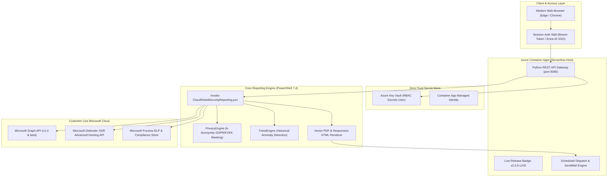

# CloudShield MSSP Platform: Enterprise Managed Security & Compliance Portal

[](https://github.com/canercetinkaya/cloudshield-mssp-portal/releases/tag/v2.5.6-LIVE)
[](https://github.com/canercetinkaya/cloudshield-mssp-portal/actions/workflows/ci-cd.yml)
[](https://github.com/canercetinkaya/cloudshield-mssp-portal/actions/workflows/secret-scanning.yml)
[](https://github.com/canercetinkaya/cloudshield-mssp-portal/actions/workflows/codeql.yml)
[](https://learn.microsoft.com/en-us/azure/container-apps/)
[](https://www.microsoft.com/security)
[](#privacy-by-design--regulatory-compliance)
[](#dual-engine-architecture)
[](#license--governance)

**CloudShield MSSP Platform** is a multi-tenant, cloud-native security orchestration, intelligence aggregation, and automated reporting suite. Designed specifically for **Microsoft Security Specialists and Managed Security Service Providers (MSSPs)**, CloudShield delivers live, consolidated CISO-ready reports and executive dashboards directly from live Microsoft Defender XDR and Microsoft Purview environments.

---

## 🌐 Live Production Deployment

- **Production Portal:** [https://cs-mssp-poc-app.icygrass-237b4292.westeurope.azurecontainerapps.io/](https://cs-mssp-poc-app.icygrass-237b4292.westeurope.azurecontainerapps.io/)
- **Active Release:** `v2.5.6-LIVE`
- **Version Endpoint:** `GET /api/version` (Health & Telemetry verification)
- **Authentication Wall:** Session-gated access with Enterprise Credentials (managed via environment variables / Azure Key Vault) or Microsoft Entra ID Single Sign-On (SSO).
- **Tenant Scope:** Exclusively live, validated customer tenants. Zero synthetic or mock tenant data.

---

## 🏛️ System Architecture

CloudShield leverages a **Dual-Engine Architecture** decoupled into a lightweight, asynchronous Web/API Gateway and a high-performance, modular PowerShell 7 data collection & intelligence engine.



---

## 🔒 Enterprise DevSecOps, RBAC & Zero-Trust Governance

CloudShield is built from the ground up on CISO-grade Zero-Trust and DevSecOps principles:

### 1. Zero Plain-Text Secrets & Git Hygiene
- **Zero Secrets in Repository:** Commits, branches, and public assets NEVER store credentials, tokens, or private keys.
- **Automated CI/CD Gates:** Every commit and PR is scanned by **Gitleaks**, **TruffleHog**, and **CodeQL SAST** workflows (`.github/workflows/secret-scanning.yml`, `.github/workflows/codeql.yml`).
- **Dynamic Credential Resolution:** Runtime secrets are injected via secure Azure Container Apps environment variables or resolved in-memory via Azure Key Vault using Container App Managed Identity.
- **Strict `.gitignore` Boundaries:** All execution transcripts, `.jsonl` audit dumps, output PDFs, and local overrides (`*.local.json`) are strictly untracked.

### 2. Azure Role-Based Access Control (Least-Privilege RBAC)
| Role Definition | Assigned Principal | Scope | Security Purpose |
| :--- | :--- | :--- | :--- |
| **Key Vault Secrets User** | Container App System Identity | Azure Key Vault | Read-only in-memory resolution of client secrets. Write or delete permissions are strictly denied. |
| **Key Vault Certificate User** | Container App System Identity | Azure Key Vault | In-memory resolution of customer tenant certificates for Certificate-Based Authentication (CBA). |
| **Storage Blob Data Contributor** | Container App System Identity | Storage Account | Encrypted at rest read/write storage for compiled executive reports and archives. |

### 3. Privacy-by-Design & GDPR / KVKK Compliance
- **Data Minimization:** No raw customer payloads, email bodies, or unstructured files are written to persistent storage.
- **k-Anonymity Dynamic Entity Masking:** `Engine/Core/PrivacyEngine.psm1` dynamically masks User Principal Names (UPNs), IP addresses, and sensitive filenames prior to PDF/HTML rendering (e.g., `c***.c***@customer.com`, `Bilanço_***.xlsx`).
- **Cryptographic Audit Footers:** Every report contains build telemetry, timestamped generation metadata, and legal disclaimers.

### 4. Strict Separation of Duties: MSSP Engineering vs. 24/7 SOC
- **Engineering Scope:** Engineered strictly for **Purview & Defender Security Engineering** (data loss prevention, sensitivity label optimization, posture hardening, and monthly executive reporting).
- **Zero 24/7 SOC Confusion:** Live alert triage is handled by an independent tier. The codebase strictly enforces zero unauthorized `SOC` / `SVC-SOC` dependencies.

---

## 💻 Local Development & Verification

### Prerequisites
- Python 3.10+ (Standard Library only)
- PowerShell 7.4+ (Cross-platform Core)
- Microsoft Edge or Google Chrome (for headless vector PDF rendering)
- Git 2.40+

### Quick Start
```powershell
# 1. Clone the repository
git clone https://github.com/canercetinkaya/cloudshield-mssp-portal.git
cd cloudshield-mssp-portal

# 2. Configure administrative credentials (optional, auto-generates securely in Data/auth.local.json if unset):
$env:PORTAL_ADMIN_USER = "admin"
$env:PORTAL_ADMIN_PASSWORD = "YourSecureEnterprisePassword123!"

# 3. Launch local portal server (Port 8080)
python Portal/api/server.py 8080

# 4. Open your browser:
# Navigate to: http://localhost:8080
```

### Comprehensive Automated QA Suite
Run the 50-point end-to-end QA validation suite covering the PowerShell engine, REST API contracts, and multi-tenant concurrency isolation:

```powershell
python test_comprehensive_qa.py
```

---

## ☁️ Azure Container Apps Deployment

CloudShield is optimized for Azure Container Apps with serverless scale-to-zero capabilities to eliminate idle hosting costs:

```bash
# Deploy to Azure Container Apps
az containerapp up \
  --name cs-mssp-poc-app \
  --resource-group rg-cloudshield-mssp \
  --location westeurope \
  --environment cae-cloudshield-mssp \
  --source . \
  --ingress external \
  --target-port 8080
```

---

## 📄 Repository Governance & Contribution

- [Security Policy](.github/SECURITY.md) - Vulnerability disclosure and Zero-Trust rules.
- [Contributing Guidelines](CONTRIBUTING.md) - Architectural guardrails and branch flow.
- [Reporting Architecture](docs/REPORTING_ARCHITECTURE.md) - Deep-dive technical engine design.

---

## 🚀 Recent Releases & Autonomous Changelog

| Release Tag | Build | Date | Autonomous Agent Summary |
| :--- | :--- | :--- | :--- |
| **v2.5.6-LIVE** | `2026.09.10.6` | 2026-09-10 | feat(docs): create docs/agents modular knowledge base and subagent task matrix |
| **v2.5.5-LIVE** | `2026.09.10.5` | 2026-09-10 | feat(reporting): 100% dynamic data shell with zero-incident verified posture and removed KQL menu |
| **v2.5.4-LIVE** | `2026.09.10.4` | 2026-09-10 | feat(docs): automate multi-document synchronization across README, CONTRIBUTING, and SECURITY with live release changelog table |
| **v2.5.3-LIVE** | `2026.09.10.3` | 2026-09-10 | fix(deploy): update README badges to v2.5.2, fix Zero SOC CI compliance in PurviewDlp and route traffic to latest ACA revision |
| **v2.5.2-LIVE** | `2026.09.10.2` | 2026-09-10 | feat(versioning): enable dynamic agent semver, live changelog UI and continuous release tagging |
---

## 📄 License & Governance

Copyright &copy; 2026 **CloudShield MSSP Global Operations**. All rights reserved.  
Confidential and Proprietary. Unauthorized distribution or reproduction is strictly prohibited under applicable intellectual property laws.
