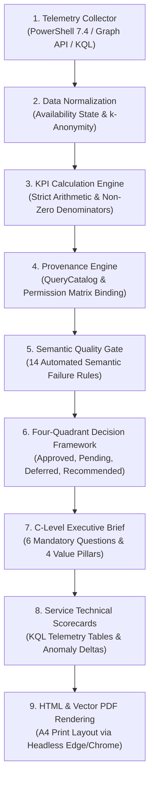
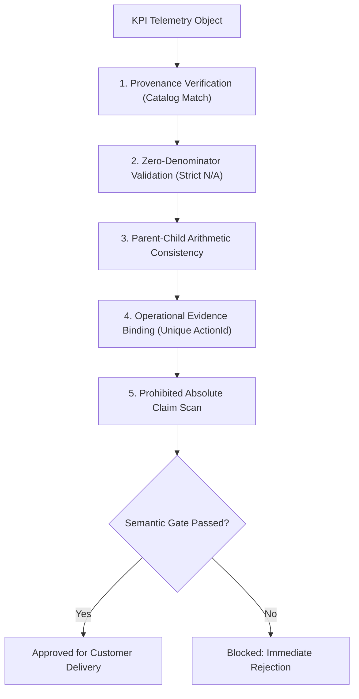
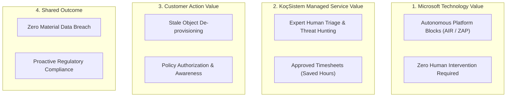
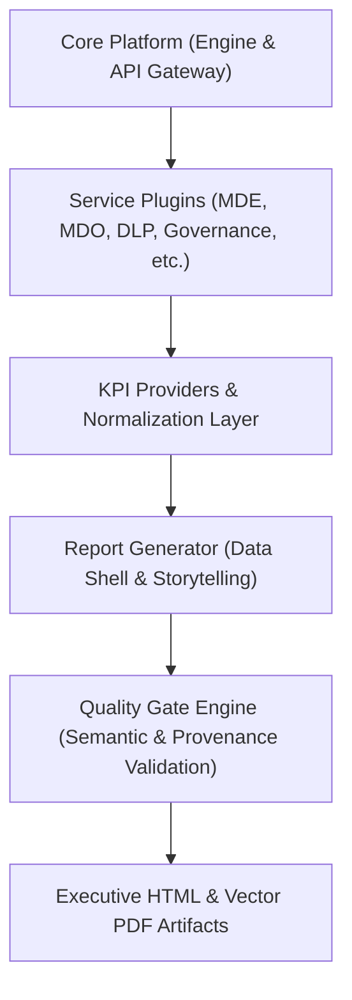

# CloudShield MSSP Platform: Enterprise Managed Security & Compliance Portal

[](https://github.com/canercetinkaya/cloudshield-mssp-portal/releases/tag/v2.5.13-PILOT)
[](#release-channels)
[](https://github.com/canercetinkaya/cloudshield-mssp-portal/actions/workflows/ci-cd.yml)
[](https://github.com/canercetinkaya/cloudshield-mssp-portal/actions/workflows/secret-scanning.yml)
[](https://github.com/canercetinkaya/cloudshield-mssp-portal/actions/workflows/codeql.yml)
[](https://learn.microsoft.com/en-us/azure/container-apps/)
[](https://www.microsoft.com/security)
[](docs/security/privacy-by-design.md)
[](#system-architecture)

**CloudShield MSSP Platform** is a multi-tenant, cloud-native managed security orchestration and automated reporting product engineered specifically for **KoçSistem Managed Security Service Provider (MSSP)** operations. It connects directly to live Microsoft Defender XDR and Microsoft Purview environments to generate executive-ready C-Level briefings, compliance scorecards, and verifiable threat posture reports.

---

## 🧭 Executive FAQ & Core Architectural Principles

### 1. What is CloudShield?
CloudShield is an enterprise-grade reporting product that transforms raw cloud telemetry into boardroom-ready intelligence. Rather than delivering static generic templates, CloudShield operates as a **100% Dynamic Data Shell**:
- **Zero Static Numbers:** Templates contain no fabricated metrics or hallucinated cost avoidances.
- **Storytelling Contract:** Every finding answers **"SO WHAT?"** through an immutable progression: `Evidence -> Meaning -> Risk -> Action`.
- **C-Level Readability:** Directly answers the 6 mandatory executive questions (*Ne Oldu?*, *Neden Önemli?*, *Microsoft Ne Sağladı?*, *KoçSistem Ne Sağladı?*, *Hangi Riskler Kaldı?*, *Hangi Kararlar Alınmalı?*).

### 2. Which Services are Supported?
The platform supports 12 modular enterprise services spanning Microsoft Defender and Purview:
| Service Code | Service Name | Management Domain | Primary Telemetry |
| :--- | :--- | :---: | :--- |
| **`SVC-MDE`** | Microsoft Defender for Endpoint | Managed EDR & TVM | `DeviceInfo`, `DeviceAlertEvents`, `DeviceEvents` |
| **`SVC-MDO`** | Microsoft Defender for Office 365 | Managed Email Security | `EmailEvents`, `EmailPostDeliveryEvents`, ZAP |
| **`SVC-MDI`** | Microsoft Defender for Identity | Managed Identity | `IdentityLogonEvents`, `IdentityQueryEvents` |
| **`SVC-MDCA`**| Microsoft Defender for Cloud Apps | Managed CASB | `CloudAppEvents`, `OAuthAppGovernance` |
| **`SVC-XDR`** | Microsoft Defender XDR Unified | Managed XDR | Cross-Domain Correlated Incidents |
| **`SVC-INTUNE`**| Microsoft Intune Compliance | Device Posture | `/deviceManagement/managedDevices` |
| **`SVC-ENTRA-PIM`**| Entra ID Protection & PIM | Identity Governance | `/identityProtection/riskyUsers`, PIM Logs |
| **`SVC-PRV-DLP`**| Microsoft Purview DLP | Data Loss Prevention | `DlpEvents`, `/security/alerts_v2` |
| **`SVC-PRV-CLASS`**| Information Protection | Classification | Sensitivity Labels & SIT Taxonomy |
| **`SVC-PRV-GOV`**| Purview Data Lifecycle & Records | Records Management | Retention Labels & Disposal Policies |
| **`SVC-PRV-RISK`**| Purview Insider Risk Management | Internal Threats | Insider Risk Policies (Isolated Profile) |
| **`SVC-AI-SECURITY`**| Purview AI Hub & GenAI Security | AI Governance | Management API `Audit.General`, Copilot Logs |

### 3. How Reports are Generated?
Reports are produced through a decoupled **Dual-Engine Pipeline**:


### 4. What Quality Gates Exist?
Before publication, reports must pass **14 Automated Semantic Quality Gates** (`test_report_quality_gate.py` and `test_post_remediation_independent_gate.py`):


### 5. How Provenance Works?
Every visible KPI card emits machine-readable lineage attributes (`data-kpi-id`, `data-source-query`, `data-origin`, `data-collection-status`). Queries must resolve to official records in `Engine/KQL/query-metadata/catalog-index.json`.

### 6. How Collection Failures are Handled?
Services are strictly assigned one of 5 availability states: `SupportedAppOnly`, `GraphUserDelegated`, `Unloaded`, `CollectionFailed`, or `UnsupportedAppOnly`. If collection fails:
- KPI cards are **suppressed** (never replaced with fake zeros or simulated averages).
- The service status is disclosed on **Page 1 in the Collection Health Matrix**.
- Internal stack traces are sanitized to prevent secret or architecture leakage.

### 7. How Customer Decisions are Represented?
Page 2 of every report incorporates a **Four-Quadrant Executive Decision Matrix**:
1. **Approved Decisions (Onaylanmış Kararlar):** Actions ratified and verified in the previous cycle.
2. **Pending Decisions (Yetkilendirme Bekleyen):** Immediate C-Level authorization requests impacting posture.
3. **Deferred Decisions (Ertelenmiş Riskler):** Customer-acknowledged risk acceptances with expiry tracking.
4. **Recommended Decisions (Stratejik Tavsiyeler):** KoçSistem engineering hardening advice with assigned owner and SLA.

### 8. How Microsoft and KoçSistem Value are Separated?
Outcomes are categorized into four non-overlapping pillars:

- **Zero Double Counting:** Autonomous platform blocks are never claimed as KoçSistem engineering work.
- **Evidence-Backed Saved Hours:** Hours derive from approved worklogs in `Data/manual-service-activities.json`. Synthetic multipliers (`actions * 1.5`) are barred.
- **FTE Capacity Gain Formula:** \(\text{FTE} = \text{ApprovedSavedHours} / 160\).

---

## 🏛️ Multi-Service Architecture



---

## 📚 Documentation Hierarchy

```mermaid
graph TD
    DocsRoot["docs/"]
    DocsRoot --> Arch["docs/architecture/"]
    DocsRoot --> Qual["docs/quality/"]
    DocsRoot --> Rep["docs/reporting/"]
    DocsRoot --> Gov["docs/governance/"]
    DocsRoot --> Sec["docs/security/"]
    DocsRoot --> Serv["docs/services/"]

    Arch --> ArchSys["system-architecture.md"]
    Arch --> ArchProv["data-provenance.md"]
    Arch --> ArchColl["collection-health-and-availability.md"]
    Arch --> ArchVer["versioning.md"]

    Qual --> QualGate["semantic-quality-gates.md"]
    Qual --> QualGold["golden-fixtures.md"]
    Qual --> QualRev["review-lifecycle.md"]

    Rep --> RepArch["reporting-architecture.md"]
    Rep --> RepExec["executive-reporting-model.md"]
    Rep --> RepStory["storytelling-contract.md"]
    Rep --> RepVal["value-attribution-model.md"]
    Rep --> RepDec["customer-decision-framework.md"]

    Gov --> GovKpi["evidence-backed-kpi-model.md"]
    Gov --> GovAct["evidence-backed-activity-model.md"]
    Gov --> GovSync["safe-sync.md"]

    Sec --> SecPerm["permission-matrix.md"]
    Sec --> SecPriv["privacy-by-design.md"]
    Sec --> SecAuth["report-artifact-authorization.md"]

    Serv --> ServCat["service-catalog.md"]
    Serv --> ServData["data-source-matrix.md"]
    Serv --> ServCap["service-capability-matrix.md"]
```



| Section | Target Documentation | Description |
| :--- | :--- | :--- |
| **Architecture** | [Master Architecture](ARCHITECTURE.md) | Authoritative 19-topic architecture specification & 5 Mermaid pipelines. |
| **Deployment** | [Deployment Guide](DEPLOYMENT.md) | Local Docker & Azure Container Apps deployment instructions. |
| **Security** | [Security Policy](SECURITY.md) | Zero Trust controls, 8-stage decision chain, and vulnerability disclosure. |
| **Contributing** | [Contributor Guide](CONTRIBUTING.md) | Development workflow, quality gates, and single-source versioning. |
| **Architecture** | [System Architecture](docs/architecture/system-architecture.md) | Dual-Engine design, ACA serverless host, multi-tenant boundaries. |
| **Architecture** | [Data Provenance](docs/architecture/data-provenance.md) | Lineage metadata, QueryCatalog mapping, cryptographic integrity. |
| **Architecture** | [Collection Health](docs/architecture/collection-health-and-availability.md) | 5 availability states, Page 1 health matrix, failure sanitization. |
| **Reporting** | [Reporting Lifecycle](docs/reporting/reporting-architecture.md) | 9-stage compilation lifecycle, dual HTML/PDF output strategy. |
| **Reporting** | [Executive Model](docs/reporting/executive-reporting-model.md) | 6 mandatory questions, 30-second CISO posture badge. |
| **Reporting** | [Storytelling Contract](docs/reporting/storytelling-contract.md) | Evidence -> Meaning -> Risk -> Action chain. |
| **Reporting** | [Value Attribution](docs/reporting/value-attribution-model.md) | Four non-overlapping pillars, Microsoft vs KoçSistem value. |
| **Reporting** | [Decision Framework](docs/reporting/customer-decision-framework.md) | Four-quadrant executive decision instrument. |
| **Quality** | [Semantic Quality Gates](docs/quality/semantic-quality-gates.md) | 14 automated failure conditions, independent gate oracle. |
| **Quality** | [Golden Fixtures](docs/quality/golden-fixtures.md) | Deterministic test fixtures, synthetic data segregation. |
| **Quality** | [Review Lifecycle](docs/quality/review-lifecycle.md) | 6-role sign-off requirements, anti-self-attestation rule. |
| **Governance** | [KPI Model](docs/governance/evidence-backed-kpi-model.md) | Metric specifications, catalog indexing, mathematical integrity. |
| **Governance** | [Activity Model](docs/governance/evidence-backed-activity-model.md) | Discrete execution evidence, worklog hours, FTE capacity gain. |
| **Security** | [Permission Matrix](docs/security/permission-matrix.md) | Least-privilege Graph and MDE read-only application scopes. |
| **Security** | [Privacy-by-Design](docs/security/privacy-by-design.md) | k-Anonymity masking, UPN and external domain anonymization. |
| **Services** | [Service Catalog](docs/services/service-catalog.md) | 12 enterprise modules, telemetry endpoints, and packages. |
| **Review** | [Repository Consistency](docs/repository-consistency-review.md) | Cross-document link audit, Mermaid validation, and gap closure. |

---

## 💻 Local Development & Automated QA Verification

### Prerequisites
- Python 3.10+ (Standard Library only)
- PowerShell 7.4+ (Cross-platform Core)
- Google Chrome or Microsoft Edge (for headless vector PDF rendering)
- Git 2.40+

### Quick Start
```powershell
# 1. Clone repository
git clone https://github.com/canercetinkaya/cloudshield-mssp-portal.git
cd cloudshield-mssp-portal

# 2. Launch portal server (Port 8080)
python Portal/api/server.py 8080
```

### Automated Quality Verification Suites
```powershell
# Run Comprehensive Platform QA Suite (65/65 tests)
python test_comprehensive_qa.py

# Run Automated Semantic Report Quality Gate (14 rules)
python test_report_quality_gate.py

# Run Independent Post-Remediation Gate Suite (21 tests)
python test_post_remediation_independent_gate.py

# Run Enterprise RBAC & Authorization Suite (9 tests)
python test_rbac_authorization.py
```

---

## 🚀 Recent Releases & Autonomous Changelog

| Release Tag | Build | Date | Autonomous Agent Summary |
| :--- | :--- | :--- | :--- |
| **v2.5.13-PILOT** | 2026.09.11.1 | 2026-09-11 | feat(rbac): enterprise rbac, customer-service matrix, authorization decision chain, and 11 admin portal views |
| **v2.5.12-PILOT** | 2026.09.10.12 | 2026-09-10 | feat(quality-gate): blocking report-product remediation and 14 semantic quality gates |
| **v2.5.11-PILOT** | 2026.09.10.11 | 2026-09-10 | fix: pilot hardening, encoding, and report registry |
| **v2.5.10-PILOT** | 2026.09.10.10 | 2026-09-10 | refactor(release): establish single-source version manifest and dynamic azure deployment discovery |
---

## 🌐 Live Pilot Deployment

- **Deployment Host:** [https://cs-mssp-poc-app.icygrass-237b4292.westeurope.azurecontainerapps.io/](https://cs-mssp-poc-app.icygrass-237b4292.westeurope.azurecontainerapps.io/)
- **Active Release:** `v2.5.13-PILOT` (Managed via Single-Source `version.json`)
- **Release Channel:** `pilot` (`productionReady: false`)
- **Version Endpoint:** `GET /api/version`

---

## 📄 License & Governance

Copyright &copy; 2026 **CloudShield MSSP Global Operations**. All rights reserved.  
Confidential and Proprietary. Unauthorized distribution or reproduction is strictly prohibited.\n