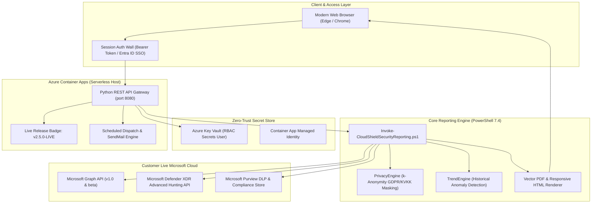

# CloudShield MSSP Platform: Enterprise Managed Security & Compliance Portal

[](https://github.com/canercetinkaya/cloudshield-mssp-portal/releases/tag/v2.5.0)
[](https://learn.microsoft.com/en-us/azure/container-apps/)
[](https://www.microsoft.com/security)
[](#privacy-by-design--regulatory-compliance)
[](#dual-engine-architecture)
[](#license--governance)

**CloudShield MSSP Platform** is a multi-tenant, cloud-native security orchestration, intelligence aggregation, and automated reporting suite. Designed specifically for **Microsoft Security Specialists and Managed Security Service Providers (MSSPs)**, CloudShield delivers live, consolidated CISO-ready reports and executive dashboards directly from live Microsoft Defender XDR and Microsoft Purview environments.

---

## 🌐 Live Production Deployment

- **Production Portal:** [https://cs-mssp-poc-app.icygrass-237b4292.westeurope.azurecontainerapps.io/](https://cs-mssp-poc-app.icygrass-237b4292.westeurope.azurecontainerapps.io/)
- **Active Release:** `v2.5.0-LIVE`
- **Version Endpoint:** `GET /api/version` (Health & Telemetry verification)
- **Authentication Wall:** Session-gated access with Enterprise Credentials (`admin` / `CloudShield2026!*`) or Entra ID Single Sign-On (SSO).
- **Tenant Scope:** Exclusively live, validated customer tenants. Zero synthetic or mock tenant data.

---

## 🏛️ System Architecture

CloudShield leverages a **Dual-Engine Architecture** decoupled into a lightweight, asynchronous Web/API Gateway and a high-performance, modular PowerShell 7 data collection & intelligence engine.



---

## 🛡️ Streamlined 8 Enterprise Managed Services (Single Unified Purview)

To eliminate service fragmentation and deliver high-value, executive-ready visibility, CloudShield rationalizes the service catalog into **8 core enterprise services**. Microsoft Purview is consolidated into **one unified managed service**, Microsoft Entra ID is unified into **one identity service**, and Defender domains remain distinct to reflect specialized engineering disciplines:

| Service Code | Service Name | Service Family | Scope & Consolidation | Auth Profile | Responsible Engineering Practice |
|:---|:---|:---|:---|:---|:---|
| **SVC-MDE** | Defender for Endpoint | Endpoint Protection | Endpoint health, antivirus, EDR incidents, attack surface reduction | OAuth 2.0 Client Credentials | Endpoint Security Engineering |
| **SVC-MDO** | Defender for Office 365 | Email & Collaboration | Phishing, malware, Safe Links/Attachments, mailbox posture | Certificate-Based Auth (CBA) | Messaging & Identity Security |
| **SVC-MDI** | Defender for Identity | Identity Threat Defense | Kerberos, lateral movement, domain controller telemetry | Managed Identity / OAuth 2.0 | Directory & Identity Engineering |
| **SVC-MDCA** | Defender for Cloud Apps | Cloud App Security | Shadow IT, OAuth app hygiene, anomalous data downloads | OAuth 2.0 Client Credentials | Cloud Infrastructure Security |
| **SVC-XDR** | Defender XDR Unified | Incident Correlation | Multi-stage incident correlation, automated investigation & response | OAuth 2.0 Client Credentials | Threat Detection & Response |
| **SVC-INTUNE** | Intune Device Compliance | Endpoint Management | Device compliance state, enrollment hygiene, encryption compliance | OAuth 2.0 Client Credentials | Endpoint Management Engineering |
| **SVC-ENTRA-ID** | Entra ID Protection & Hygiene | Identity & Access | Privileged Identity Management (PIM), risky users, sign-in risk events | OAuth 2.0 Client Credentials | Directory & Identity Engineering |
| **SVC-PURVIEW** | Microsoft Purview Suite | Compliance & Governance | **Single Unified Report**: DLP policies, sensitivity labels, lifecycle/retention & insider risk | OAuth 2.0 Client Credentials | Data Governance & Privacy |

> [!TIP]
> **Reporting Architecture & Topology Map:** For an in-depth breakdown of every report's data sources, Graph API endpoints, Advanced Hunting KQL tables (`DeviceInfo`, `DeviceEvents`, `EmailEvents`, `IdentityLogonEvents`, `CloudAppEvents`, `SecurityIncident`, `DlpEvents`), and vector PDF rendering pipeline, see [docs/REPORTING_ARCHITECTURE.md](docs/REPORTING_ARCHITECTURE.md).

---

## 🔒 Security, Zero-Trust & Privacy

### 1. Zero Plain-Text Secrets (Git-Safe Guarantee)
- All tenant credentials utilize Azure Key Vault Secret URIs or environment overrides.
- Commits and repository assets never store plain-text secrets (`ClientSecret: ""`).
- Local testing overrides are stored in `.gitignore`-safeguarded files (`Data/tenants.local.json`).

### 2. Privacy-by-Design & GDPR / KVKK Compliance
- **Data Minimization:** No raw customer payloads, file contents, or personal records are stored on disk.
- **k-Anonymity Entity Masking:** The `PrivacyEngine.psm1` dynamically masks User Principal Names (UPNs) and sensitive file names before PDF rendering (e.g., `c***.c***@customer.com`, `Mali_Tablo_***.xlsx`).
- **Audit Verification:** Every report footer contains a tamper-proof cryptographic build signature and legal compliance disclaimers.

### 3. Separation of Duties: Engineering vs. SOC
- **Zero 24/7 SOC Confusion:** This platform is engineered strictly for **MSSP Purview & Defender Security Engineering** (policy refinement, DLP lifecycle management, posture optimization, and executive reporting).
- 24/7 Security Operations Center (SOC) alert triage operates as an independent, peer tier.

---

## 💻 Local Development & Verification

### Prerequisites
- Python 3.10+
- PowerShell 7.4+ (Cross-platform Core)
- Microsoft Edge or Google Chrome (for headless vector PDF rendering)
- Git

### Quick Start
```powershell
# 1. Clone the repository
git clone https://github.com/canercetinkaya/cloudshield-mssp-portal.git
cd cloudshield-mssp-portal

# 2. Launch local portal server (Port 8080)
python Portal/api/server.py 8080

# 3. Open your browser:
# Navigate to: http://localhost:8080
# Credentials: admin / CloudShield2026!*
```

### Comprehensive Automated QA Suite
Run the 50-point end-to-end QA validation suite covering the PowerShell engine, REST API contracts, and multi-tenant concurrency isolation:

```powershell
python test_comprehensive_qa.py
```

---

## ☁️ Azure Container Apps Deployment

CloudShield is optimized for Azure Container Apps with serverless scale-to-zero capabilities to eliminate idle hosting costs:

```bash
# Deploy to Azure Container Apps
az containerapp up \
  --name cs-mssp-poc-app \
  --resource-group rg-cloudshield-mssp \
  --location westeurope \
  --environment cae-cloudshield-mssp \
  --source . \
  --ingress external \
  --target-port 8080
```

---

## 📄 License & Governance

Copyright &copy; 2026 **CloudShield MSSP Global Operations**. All rights reserved.  
Confidential and Proprietary. Unauthorized distribution or reproduction is strictly prohibited under applicable intellectual property laws.
