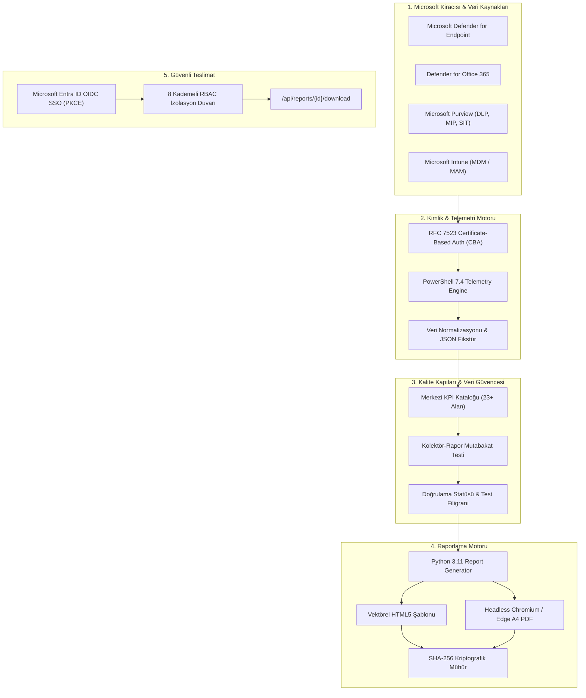

# CloudShield Security Reporting & Managed Services Visibility Platform

> **Microsoft Güvenlik ve Uyumluluk İş Yükleri İçin Aylık Raporlama, Yönetilen Hizmet Görünürlüğü ve Denetim Platformu**

[](https://github.com/canercetinkaya/cloudshield-mssp-portal/actions/workflows/ci-cd.yml)
[](RELEASE_NOTES.md)
[](CONTROLLED_PILOT.md)
[](Portal/api/)
[](Engine/)

---

## 1. Ürün Adı ve Kısa Tanım

**CloudShield Security Reporting & Managed Services Visibility Platform**, Microsoft güvenlik ve uyumluluk servislerini yönetilen hizmet olarak alan kurumsal müşteriler için tasarlanmış; **güvenilir, müşteri bazlı, ürün özelinde aylık güvenlik raporları üreten, yönetilen hizmet görünürlüğü sağlayan ve raporları güvenli şekilde sunan** bir platformdur.

Platform; SIEM, SOAR, MDR veya canlı alarm kuyruğu (SOC analyst workbench) değildir. Odak noktası, dağınık Microsoft telemetrisini yönetici ve teknik seviyede anlamlandırarak **yönetilen hizmet değerini kanıtlanabilir çıktılarla görünür kılmaktır**.

---

## 2. Ürünün Çözdüğü Problem

Kurumsal Microsoft güvenlik ekosistemlerinde yöneticilerin ve servis sağlayıcıların karşılaştığı temel problemler:
- **Farklı Portallarda Dağınık Veri:** Defender for Endpoint, Defender for Office 365, Intune ve Purview'un ayrı konsollarda telemetri üretmesi nedeniyle bütünleşik risk tablosunun görülememesi.
- **Görünmeyen Yönetilen Hizmet Değeri:** Hizmet sağlayıcı mühendislerin yaptığı politika optimizasyonlarının, kural tuning'lerinin ve sıkılaştırmaların müşterinin üst yönetimi tarafından fark edilmemesi.
- **Teknik Veriyi Anlamlandırma Zorluğu:** Ham alarm sayılarının ve telemetri loglarının C-Level yöneticiler (CISO, CIO) için stratejik karara dönüştürülememesi.
- **İzlenebilirlik ve Doğruluk Eksikliği:** Raporlarda yer alan sayıların hangi API'den, hangi sorguyla çekildiğinin belirsiz olması ve sentetik çarpanlarla güven erozyonu yaratılması.

---

## 3. Platform Ne Yapar?

Platform, doğrulanmış kod yetenekleriyle şu işlevleri icra eder:
1. **Telemetri Toplama:** Microsoft Graph API, Defender Advanced Hunting KQL ve Purview AuditLog üzerinden telemetri toplar.
2. **Normalizasyon:** Toplanan verileri 15 iş yükü özelinde standart veri modeline dönüştürür.
3. **Doğrulanmış KPI Üretimi:** Her metrik için kaynak, formül ve güven düzeyi bilgisiyle (KPI provenance) metrik hesaplar.
4. **Şeffaf Eksik Veri:** Veri toplanamadığında sıfır yazmak yerine durumu açıkça `N/A`, `Yapılandırılmamış` veya `İzin Yok` olarak sunar.
5. **Gözlemlenen Değişiklikleri Raporlama:** Bilet veya form doldurma yükü olmadan, tenant konfigürasyonundaki somut iyileştirmeleri denetim izlerinden otomatik gösterir.
6. **Çift Format Çıktı:** Vektörel HTML5 ve baskıya hazır A4 PDF çıktısı üretir; SHA-256 kriptografik mühür ile rapor bütünlüğü sağlar.
7. **Zero Trust Kiracı İzolasyonu:** Müşterilerin yalnızca kendi raporlarına erişebileceği katı izolasyon duvarı uygular.

---

## 4. Desteklenen Microsoft İş Yükleri

| İş Yükü | Toplanan Veri Türleri | Raporda Gösterilen Temel Alanlar | Gerekli İzin / Lisans | Doğrulama Statüsü |
| :--- | :--- | :--- | :--- | :--- |
| **Microsoft Defender for Endpoint** | Cihaz envanteri, sensör sağlığı, TVM zafiyetleri, ASR olayları | İzlenen Cihaz, Sensör Kapsamı %, Otonom Bloklar, TVM Uyum % | `Machine.Read.All`, `AdvancedHunting.Read.All` (MDE P2 / E5) | **Canlı Tenant Üzerinde Doğrulandı** |
| **Microsoft Defender for Office 365** | E-posta trafiği, kimlik avı, zararlı ekler, Safe Links, ZAP | Taranan Posta, Phishing/Malware Blokları, ZAP Sayısı, Şüpheli Bildirim Triyajı | `SecurityEvents.Read.All` (MDO P2 / E5) | **Canlı Tenant Üzerinde Doğrulandı** |
| **Microsoft Intune** | Cihaz uyumluluk durumları, BitLocker/FileVault şifreleme, OS | Cihaz Uyum %, Şifrelenmiş Cihaz Sayısı, Platform Ayrışımı (Win/iOS/Android/macOS) | `DeviceManagementManagedDevices.Read.All` (Intune Plan 1) | **Canlı Tenant Üzerinde Doğrulandı** |
| **Microsoft Purview DLP** | DLP kural eşleşmeleri, bloklama olayları, kural aşımları | DLP Eşleşme, Otonom Blok, Koruma Oranı %, Override Dağılımı ve Gerekçeleri | `InformationProtectionPolicy.Read.All` (M365 E5 / Compliance) | **Canlı Tenant Üzerinde Doğrulandı** |
| **Purview Information Protection** | Sensitivity Labels, etiketleme trendleri, şifreleme duruşu | Etiketli Belge Hacmi, En Çok Kullanılan Etiketler, Etiket Değişiklik Kütüğü | `InformationProtectionPolicy.Read.All` (M365 E5) | **Kodlandı, Canlı Doğrulama Bekliyor** |
| **Purview Sensitive Info Types (SIT)** | Standart ve özel SIT tanımları, regex ve doğruluk eşikleri | Tanımlı SIT Sayısı, En Çok Tetiklenen SIT'ler (TCKN, Kredi Kartı, IBAN) | `InformationProtectionPolicy.Read.All` (M365 E5) | **Kodlandı, Canlı Doğrulama Bekliyor** |
| **Defender for Identity (MDI)** | DC telemetrisi, NTLMv1/v2 kullanımı, Kerberos alarmları | Sağlıklı DC Sayısı, Güvensiz Protokol Kullanımı, Şüpheli Kimlik Hareketleri | `SecurityAlert.Read.All`, `IdentityLogonEvents` (MDI / E5) | **Kodlandı, Canlı Doğrulama Bekliyor** |
| **Defender for Cloud Apps (MDCA)** | Shadow IT keşif verisi, onaylı/onaysız uygulamalar, OAuth | Keşfedilen SaaS Uygulamaları, Yüksek Riskli Uygulama Sayısı, Sanction Kararları | `CloudAppSecurity.Read.All` (MDCA / E5) | **Kodlandı, Canlı Doğrulama Bekliyor** |
| **Defender for Cloud (MDC)** | Azure Secure Score, bulut güvenlik önerileri, açık portlar | Secure Score %, Kritik Güvenlik Önerileri, İnternete Açık Kaynaklar | `Microsoft.Security/assessments/read` (Defender CSPM) | **Kodlandı, Canlı Doğrulama Bekliyor** |
| **Purview Insider Risk Management** | İç tehdit politikası göstergeleri, veri dışarı çıkarma riski | Aktif Politika Sayısı, Yüksek Riskli Kullanıcı Trendleri | `AuditLog.Read.All`, `SecurityAlert.Read.All` (M365 E5) | **Kodlandı, Canlı Doğrulama Bekliyor** |
| **Purview Communication Compliance** | Kurumsal iletişim denetim kuralları, uygunsuz içerik | Eşleşen İletişim Olayları, İncelenen Mesaj Oranı | `Compliance.Read.All` (M365 E5) | **Kodlandı, Canlı Doğrulama Bekliyor** |
| **Purview Data Lifecycle Management** | Saklama (retention) ilkeleri, otomatik etiketleme/silme | Aktif Saklama İlkeleri, Konum Kapsamı (SPO/OD/EXO) | `InformationProtectionPolicy.Read.All` (M365 E3/E5) | **Kısmi Destekleniyor** |
| **Purview Records Management** | Kayıt (record) tanımları, imha (disposition) süreçleri | Kayıt Olarak İşaretlenen Öğe Sayısı, İmha Bekleyenler | `RecordsManagement.Read.All` (M365 E5 Compliance) | **Kısmi Destekleniyor** |
| **Microsoft Purview DSPM** | Çoklu bulut veri depoları, hassas veri haritası, erişimler | Taranan Veri Deposu Hacmi, Hassas Veri Yoğunluğu | `DataSecurityPosture.Read.All` (Purview DSPM) | **Kodlandı, Canlı Doğrulama Bekliyor** |
| **Purview DSPM for AI** | Copilot ve GenAI etkileşimlerinde hassas veri kullanımı | AI Güvenlik Olayları, Prompt Sızıntı Denetimi, Etiketli Veri Tüketimi | `SecurityEvents.Read.All`, `AuditLog.Read.All` (Copilot & Purview E5) | **İzin veya Lisans Engelli** |

---

## 5. Raporlarda Neler Gösterilir?

Her aylık raporda yer alan temel bölümler:
- **C-Level Yönetici Bilgi Notu (Executive Brief):** 6 soruluk yönetici özeti (Ne oldu, neden önemli, Microsoft ne sağladı, CloudShield ne yaptı, hangi artık riskler var, hangi kararlar bekleniyor).
- **Dört Temel Değer Sütunu (Service Value Attribution):** Microsoft otonom aksiyonları, CloudShield yönetilen hizmet değeri, müşteri BT eforu ve artık risk ayrımı.
- **🛡️ Bu Ay Gerçekleştirilen İyileştirmeler:** Tenant denetim kütüklerinden (Audit Logs) otomatik türetilen somut politika güncellemeleri ve teknik güvenlik çıktıları.
- **Operasyonel Performans & Tehdit Barometresi:** İş yükü özelinde sensör kapsamı, kural eşleşmeleri, karantina triyajı veya DLP kanal dağılımı.
- **12 Aylık Trend Analizi:** Geçen aya ve geçmiş dönemlere kıyasla risklerin yönelimi (artan/azalan riskler).
- **Müşteri Stratejik Karar Matrisi:** Müşteri yönetiminin onaylaması önerilen P0, P1 ve P2 öncelikli güvenlik kararları.

Örnek çıktıları incelemek için [Örnek Raporlar Dokümanına](docs/samples/README.md) göz atabilirsiniz.

---

## 6. Veri Doğruluğu Yaklaşımı

- **Sıfır Sentetik Çarpan:** Alarm veya olay sayıları katsayılarla çarpılamaz; cihaz oranları tahminlenemez.
- **Sıfır Mock Veri:** Üretim raporlarına sentetik veya mock veri aktarılamaz.
- **Eksik Veri Şeffaflığı:** Veri yoksa `0` gösterilmez; `N/A` veya `Yapılandırılmamış` durumu açıklanır.
- **Kolektör-Rapor Mutabakatı:** Kolektörden gelen ham sayı ile rapordaki sayı birebir test edilir (`test_collector_to_report_reconciliation.py`).
- **Test Filigranı:** Canlı doğrulanmamış her rapora belirgin uyarı afişi eklenir.

---

## 7. Mimari


```mermaid
flowchart TD
    subgraph Sources ["1. Microsoft Kiracısı & Veri Kaynakları"]
        MDE["Microsoft Defender for Endpoint"]
        MDO["Defender for Office 365"]
        PRV["Microsoft Purview (DLP, MIP, SIT)"]
        INT["Microsoft Intune (MDM / MAM)"]
    end

    subgraph Ingestion ["2. Kimlik & Telemetri Motoru"]
        CBA["RFC 7523 Certificate-Based Auth (CBA)"]
        PSMotor["PowerShell 7.4 Telemetry Engine"]
        Normalize["Veri Normalizasyonu & JSON Fikstür"]
    end

    subgraph Quality ["3. Kalite Kapıları & Veri Güvencesi"]
        Catalog["Merkezi KPI Kataloğu (23+ Alan)"]
        Reconciliation["Kolektör-Rapor Mutabakat Testi"]
        Watermark["Doğrulama Statüsü & Test Filigranı"]
    end

    subgraph Generation ["4. Raporlama Motoru"]
        RepGen["Python 3.11 Report Generator"]
        HTMLOut["Vektörel HTML5 Şablonu"]
        PDFOut["Headless Chromium / Edge A4 PDF"]
        Seal["SHA-256 Kriptografik Mühür"]
    end

    subgraph Delivery ["5. Güvenli Teslimat"]
        EntraSSO["Microsoft Entra ID OIDC SSO (PKCE)"]
        RBAC["8 Kademeli RBAC İzolasyon Duvarı"]
        SecureDownload["/api/reports/{id}/download"]
    end

    Sources --> CBA --> PSMotor --> Normalize --> Catalog --> Reconciliation --> Watermark --> RepGen
    RepGen --> HTMLOut & PDFOut --> Seal
    EntraSSO --> RBAC --> SecureDownload
```

---

## 8. Repository Yapısı

```
├── .github/                  # CI/CD iş akışları, issue ve pull request şablonları
├── Azure/                    # Azure Container Apps Bicep ve dağıtım betikleri
├── config/                   # Merkezi KPI, sorgu, izin ve servis katalogları
├── Data/                     # Kiracı tanımları, versiyon bilgisi ve şablon yapılandırmaları
├── database/                 # SQLite şeması ve artımlı migrasyon dosyaları (001-004)
├── Docker/                   # Hardened multi-stage Dockerfile ve entrypoint betiği
├── docs/                     # Sistem mimarisi, güvenlik, uyumluluk dokümanları
│   └── samples/              # Sentetik etiketli HTML ve PDF örnek raporlar
├── Engine/                   # PowerShell 7.4 telemetri kolektörleri ve KQL motoru
├── Portal/                   # Python 3.11 REST API, RBAC motoru, raporlama motoru ve web arayüzü
├── Scripts/                  # Kurulum, test ve örnek rapor üretim yardımcı betikleri
└── tests/                    # Birim, güvenlik, kalite kapısı ve mutabakat testleri
```

---

## 9. Hızlı Başlangıç

### Gereksinimler
- Python 3.11+
- PowerShell 7.4+ Core
- Google Chrome veya Microsoft Edge (PDF çıktısı için)
- Docker (isteğe bağlı)

### Yerel Çalıştırma
```bash
# 1. Depoyu klonlayın
git clone https://github.com/canercetinkaya/cloudshield-mssp-portal.git
cd cloudshield-mssp-portal

# 2. Veritabanını başlatın
python -c "from database.db import init_db; init_db()"

# 3. Testleri çalıştırın
python -m unittest discover tests

# 4. Web portalını başlatın
python Portal/api/server.py 8080
```
Tarayıcınızda `http://localhost:8080` adresini açınız.

### Container ile Çalıştırma
```bash
docker build -t cloudshield-reporting-platform:3.1.0 -f Docker/Dockerfile .
docker run -d -p 8080:8080 --name cloudshield-app -e ENVIRONMENT=production -e MAX_REPLICAS=1 cloudshield-reporting-platform:3.1.0
```

---

## 10. Konfigürasyon

| Değişken Adı | Amaç | Zorunlu mu? | Güvenlik Notu |
| :--- | :--- | :---: | :--- |
| `PORT` | Web dinleme portu | Opsiyonel (8080) | Standart non-privileged port. |
| `ENVIRONMENT` | Çalışma modu (`production`/`development`) | Zorunlu | Üretimde yerel parola ile giriş kilitlenir. |
| `MAX_REPLICAS` | Container replika sayısı | Zorunlu | SQLite WAL modu için **kesinlikle `1` olmalıdır**. |
| `CLOUDSHIELD_SESSION_SECRET` | 256-bit oturum imzalama anahtarı | Zorunlu (Prod) | En az 32 karakter olmalıdır. |
| `ENTRA_CLIENT_ID` | Entra ID Uygulama ID | Zorunlu (Prod) | OIDC SSO için Azure portalından temin edilir. |
| `ENTRA_TENANT_ID` | Entra ID Kiracı ID | Zorunlu (Prod) | Token imza doğrulaması için kullanılır. |
| `KEY_VAULT_URL` | Azure Key Vault HTTPS URL'i | Opsiyonel (Azure) | Managed Identity ile anahtar okuma. |

---

## 11. Test ve Kalite Kapıları

Platformda 4 kademeli otomatik test güvencesi bulunmaktadır:
- **Birim ve Güvenlik Testleri (`tests/`):** 92 otomatik test (`python -m unittest discover tests`).
- **Kapsamlı QA Test Paketi (`tests/test_comprehensive_qa.py`):** 60 platform kalite kapısı.
- **Kolektör-Rapor Mutabakat Testi (`tests/test_collector_to_report_reconciliation.py`):** 9 iş yükü mutabakat testi.
- **Veri Doğruluk Kapıları (`tests/test_data_accuracy_gates.py`):** Sentetik çarpan ve bilet referansı yasağı kontrolleri.

---

## 12. Güvenlik Modeli

- **Entra ID OIDC SSO & PKCE:** Üretim ortamında yerel parola kapalıdır (`403 Forbidden`).
- **8 Kademeli RBAC:** Her API isteği kimlik, izin, kiracı ve servis kontrolünden geçer.
- **Kayıt Defteri Tabanlı Rapor İndirme:** Yetkisiz dizin gezinmesini (path traversal) engelleyen `report_id` doğrulaması.
- **k-Anonymity Dinamik Maskeleme:** Kişisel veriler ve dosya adları maskelenerek sunulur (`k-anon***@domain.com`).
- **Tek Replika SQLite Kilidi:** `verify_replica_safety()` çoklu replikada açılışı durdurur.

---

## 13. Kontrollü Pilot Sınırları

- **SQLite Tek Replika:** Yatay ölçekleme kapalıdır (`MAX_REPLICAS=1`).
- **Hedef Mimari:** Faz 3 kapsamında Azure Database for PostgreSQL ve Azure Redis Cache'e geçilecektir.
- **Lisans Bağımlılıkları:** M365 E5 / Compliance lisansı olmayan kiracılarda ilgili servisler `Lisans Yok` olarak işaretlenir.

---

## 14. Ürün Kapsamı Dışında Olanlar

- SIEM (Microsoft Sentinel alternatifi değildir)
- SOAR ve otomatik orkestrasyon
- SOC analist alarm izleme kuyruğu
- Olay müdahale (Incident response / case management)
- ServiceNow, Jira veya Azure DevOps bilet yönetimi

---

## 15. Yol Haritası (Roadmap)

- **Faz 1 (Tamamlandı):** Raporlama stüdyosu, yönetilen hizmet görünürlüğü, sıfır bilet modeli, veri doğruluk kapıları.
- **Faz 2 (Mevcut Aşama):** Kontrollü pilot müşterilerde canlı tenant API doğrulamasının tamamlanması.
- **Faz 3 (Planlandı):** Azure Database for PostgreSQL geçişi, Azure Private Endpoint altyapısı.
- **İleri Dönem:** Çoklu bulut genişletmeleri ve gelişmiş kıyaslama (benchmarking).

---

## 16. Lisans, Gizlilik ve Kullanım

Bu yazılım kurumsal mülkiyete (Proprietary) tabidir. İzinsiz kopyalanamaz veya dağıtılamaz. Üretilen raporlar TLP:AMBER gizlilik seviyesindedir ve ticari sır niteliğindedir.

---

## 17. Katkı ve Güvenlik Bildirimi

- Projeye katkıda bulunmak için [CONTRIBUTING.md](CONTRIBUTING.md) kılavuzunu inceleyiniz.
- Güvenlik açığı bildirimleri için lütfen herkese açık issue açmayınız; [SECURITY.md](SECURITY.md) doğrultusunda [GitHub Security Advisories](https://github.com/canercetinkaya/cloudshield-mssp-portal/security/advisories) üzerinden özel bildirimde bulununuz.
