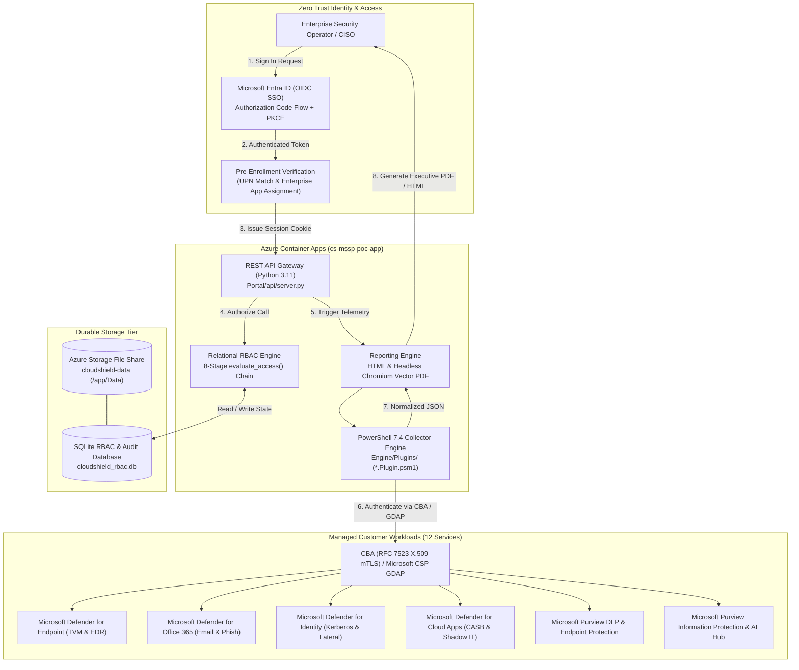

# CloudShield Enterprise MSSP Security & Compliance Platform

[](https://github.com/canercetinkaya/cloudshield-mssp-portal/releases/tag/v2.5.15-PILOT)
[](https://cs-mssp-poc-app.icygrass-237b4292.westeurope.azurecontainerapps.io/)
[](SECURITY.md)
[](Azure/main.bicep)
[%20%2B%20GDAP-blueviolet.svg)](docs/security/CBA_GDAP_Standard.md)
[](https://github.com/canercetinkaya/cloudshield-mssp-portal/actions/workflows/ci-cd.yml)
[](tests/)

**CloudShield Enterprise MSSP Platform** is a multi-tenant Managed Security Service Provider (MSSP) orchestration, governance, and executive reporting solution engineered for enterprise Microsoft cloud environments.

The platform connects to client **Microsoft Defender XDR** and **Microsoft Purview** tenants to collect live security telemetry, normalize indicators, enforce mathematical and privacy consistency, and produce boardroom-ready executive briefings and actionable remediation backlogs.

---

## 🌐 Live Production Deployment

- **Production Portal URL:** [https://cs-mssp-poc-app.icygrass-237b4292.westeurope.azurecontainerapps.io/](https://cs-mssp-poc-app.icygrass-237b4292.westeurope.azurecontainerapps.io/)
- **Active Revision:** `cs-mssp-poc-app--0000047` (Provisioning State: `Succeeded`, Status: `Healthy`)
- **Hosting Environment:** Azure Container Apps (ACA) in `westeurope`
- **Scale Rules:** Serverless autoscaling with `minReplicas = 1` (zero cold-start) to `maxReplicas = 3`
- **Persistent Volume:** Azure File Share `cloudshield-data` (`csmsspqwy6wesa`) mounted directly at `/app/Data`
- **Identity Provider:** Microsoft Entra ID (OIDC SSO) with mandatory tenant pre-enrollment and assignment check

---

## 🏗️ High-Level System Architecture


```mermaid
flowchart TD
    subgraph Identity ["Zero Trust Identity & Access"]
        ClientUser["Enterprise Security Operator / CISO"]
        EntraID["Microsoft Entra ID (OIDC SSO)<br/>Authorization Code Flow + PKCE"]
        PreEnroll["Pre-Enrollment Verification<br/>(UPN Match & Enterprise App Assignment)"]
    end

    subgraph AzureACA ["Azure Container Apps (cs-mssp-poc-app)"]
        APIGateway["REST API Gateway (Python 3.11)<br/>Portal/api/server.py"]
        RBACEngine["Relational RBAC Engine<br/>8-Stage evaluate_access() Chain"]
        ReportEngine["Reporting Engine<br/>HTML & Headless Chromium Vector PDF"]
        PSCollector["PowerShell 7.4 Collector Engine<br/>Engine/Plugins/ (*.Plugin.psm1)"]
    end

    subgraph StorageTier ["Durable Storage Tier"]
        AzureFiles[("Azure Storage File Share<br/>cloudshield-data (/app/Data)")]
        SQLiteDB[("SQLite RBAC & Audit Database<br/>cloudshield_rbac.db")]
        AzureFiles --- SQLiteDB
    end

    subgraph CustomerTenants ["Managed Customer Workloads (12 Services)"]
        AuthMethod["CBA (RFC 7523 X.509 mTLS) / Microsoft CSP GDAP"]
        MDE["Microsoft Defender for Endpoint (TVM & EDR)"]
        MDO["Microsoft Defender for Office 365 (Email & Phish)"]
        MDI["Microsoft Defender for Identity (Kerberos & Lateral)"]
        MDCA["Microsoft Defender for Cloud Apps (CASB & Shadow IT)"]
        PurviewDLP["Microsoft Purview DLP & Endpoint Protection"]
        PurviewGov["Microsoft Purview Information Protection & AI Hub"]
    end

    ClientUser -->|1. Sign In Request| EntraID
    EntraID -->|2. Authenticated Token| PreEnroll
    PreEnroll -->|3. Issue Session Cookie| APIGateway
    APIGateway -->|4. Authorize Call| RBACEngine
    RBACEngine <-->|Read / Write State| SQLiteDB
    APIGateway -->|5. Trigger Telemetry| ReportEngine
    ReportEngine --> PSCollector
    PSCollector -->|6. Authenticate via CBA / GDAP| AuthMethod
    AuthMethod --> MDE & MDO & MDI & MDCA & PurviewDLP & PurviewGov
    PSCollector -->|7. Normalized JSON| ReportEngine
    ReportEngine -->|8. Generate Executive PDF / HTML| ClientUser
```

---

## 🛡️ Core Enterprise Capabilities

### 1. Microsoft Entra ID Single Sign-On (OIDC SSO)
- Fully managed OpenID Connect authentication using Microsoft Entra ID authorization code flow.
- **Fail-Closed Zero Trust:** Legacy plaintext credentials and simulated authentication stubs are retired (`410 Gone`).
- **Pre-Enrollment Security:** Users must be pre-enrolled in the platform and assigned in the Azure Enterprise Application (`Assignment Required: Yes`).
- Cryptographically secure session management with `HttpOnly`, `Secure`, and `SameSite=Lax` cookies.

### 2. Live Customer Authorization Standard (CBA & GDAP)
- **Zero Plaintext Secrets:** Live customer tenant onboarding strictly rejects raw client secrets (`400 Bad Request`).
- **Certificate-Based Authentication (CBA):** Uses RFC 7523 X.509 certificate credentials managed in Azure Key Vault.
- **Microsoft CSP GDAP:** Seamless Granular Delegated Admin Privileges token acquisition for Tier-1 MSP partners.

### 3. Persistent Azure Storage File Share Volume Mount
- All relational RBAC data, tenant configurations, and cryptographic audit logs reside in the `cloudshield-data` Azure File Share.
- Persistent volume mount at `/app/Data` guarantees state durability across revisions, rolling deployments, and container restarts.

### 4. 100% Dynamic Telemetry & Zero Fiction
- Zero hardcoded or estimated metrics; every card, table, and trend is backed by live KQL Advanced Hunting or Microsoft Graph queries.
- Missing data disclosure: When sensors or devices report 0, metrics render `N/A`, avoiding deceptive compliance illusions.

### 5. Privacy-by-Design ($k=5$) & Cryptographic Audit
- Automatic $k$-Anonymity grouping: Activity sets with fewer than 5 impacted identities are aggregated to prevent re-identification.
- Salted SHA-256 masking for user principal names (`a***.y***@domain.com`) and file names (`Mali_Rapor_***.xlsx`).
- Append-only cryptographic audit logging for KVKK and GDPR compliance.

---

## 📦 Supported Security & Compliance Workloads (12 Services)

| Service ID | Service Name | Workload Scope | Primary Telemetry Sources | Collector Module |
| :--- | :--- | :---: | :--- | :--- |
| `SVC-MDE` | Microsoft Defender for Endpoint | EDR & TVM | `DeviceInfo`, `DeviceAlertEvents`, `DeviceTvmSoftwareVulnerabilities` | `DefenderEndpoint.Plugin.psm1` |
| `SVC-MDO` | Microsoft Defender for Office 365 | Email & Collaboration | `EmailEvents`, `EmailPostDeliveryEvents`, `ThreatExploration` | `DefenderOffice.Plugin.psm1` |
| `SVC-MDI` | Microsoft Defender for Identity | Active Directory & Identity | `IdentityLogonEvents`, `IdentityQueryEvents`, `LateralMovement` | `DefenderIdentity.Plugin.psm1` |
| `SVC-MDCA`| Microsoft Defender for Cloud Apps | CASB & Shadow IT | `CloudAppEvents`, `OAuthAppAuthorizations`, `AppDiscovery` | `DefenderCloudApps.Plugin.psm1` |
| `SVC-XDR` | Microsoft Defender XDR | Unified Incident Response | `SecurityAlert`, `SecurityIncident`, `IncidentEvidence` | `DefenderXdr.Plugin.psm1` |
| `SVC-INTUNE`| Microsoft Intune | Endpoint Compliance | `DeviceManagement/managedDevices`, `DeviceCompliancePolicies` | `IntuneCompliance.Plugin.psm1` |
| `SVC-ENTRA-PIM`| Entra ID Protection & PIM | Identity Governance | `IdentityProtection/riskyUsers`, `PrivilegedIdentityManagement` | `EntraGovernance.Plugin.psm1` |
| `SVC-PRV-DLP`| Microsoft Purview DLP | Data Loss Prevention | `Audit.General`, `DlpEvents`, `EndpointDlpActivity` | `PurviewDlp.Plugin.psm1` |
| `SVC-PRV-CLASS`| Purview Information Protection | Sensitive Data Discovery | `InformationProtection/sensitivityLabels`, `DataClassification` | `PurviewClassification.Plugin.psm1` |
| `SVC-PRV-GOV`| Purview Data Lifecycle | Retention & Records | `DataLifecycle/retentionPolicies`, `DispositionReviews` | `PurviewGovernance.Plugin.psm1` |
| `SVC-PRV-RISK`| Purview Insider Risk Management | Internal Risk & Exfiltration | `InsiderRisk/alerts`, `SecurityAndCompliance/auditLog` | `PurviewRiskCompliance.Plugin.psm1` |
| `SVC-AI-SECURITY`| Microsoft Purview AI Hub | GenAI Security & Copilot | `Audit.General (Copilot)`, `AiInteractions`, `DataSecurity` | `PurviewAiSecurity.Plugin.psm1` |

---

## 📂 Repository Directory Layout

```
CloudShieldMSSPPortal/
├── .github/                      # CI/CD pipelines, secret scanning, CodeQL, security policies
│   ├── workflows/                # ci-cd.yml, secret-scanning.yml, codeql.yml
│   ├── ISSUE_TEMPLATE/           # Standardized GitHub issue templates
│   └── PULL_REQUEST_TEMPLATE.md  # Standard pull request checklist
├── Azure/                        # Infrastructure as Code (IaC)
│   ├── main.bicep                # Complete Bicep deployment (ACA, Azure Files, Key Vault)
│   ├── azuredeploy.json          # Azure Resource Manager (ARM) template
│   └── deploy_aca.py             # Serverless deployment orchestrator
├── config/                       # Central service catalog & platform definitions
├── Data/                         # Persistent database, tenant registry, and auth configuration
│   ├── cloudshield_rbac.db       # Relational SQLite database (persisted on Azure Files)
│   ├── auth_config.json          # Microsoft Entra ID OIDC SSO parameters
│   └── tenants.json              # Tenant catalog with CBA thumbprints and metadata
├── database/                     # Database engine & migrations
│   ├── db.py                     # Connection manager, transactions, seed helpers
│   └── migrations/               # Versioned SQL migrations (001_initial_rbac_schema.sql)
├── Docker/                       # Container runtime specifications
│   └── Dockerfile                # Production multi-stage container build
├── docs/                         # System architecture, compliance, reviews, and guides
│   ├── governance/               # Engineering rules, AI governance, coding standards
│   ├── security/                 # CBA/GDAP standards, threat model, RBAC policies
│   ├── compliance/               # KVKK/GDPR compliance, k-anonymity proof
│   └── reviews/                  # Quality reviews and audit reports
├── Engine/                       # PowerShell 7.4 Telemetry Collection Engine
│   ├── Core/                     # Authentication (CBA/GDAP), DPAPI, PrivacyEngine
│   └── Plugins/                  # 12 Workload Telemetry Collector Modules
├── Portal/                       # Full-Stack Web Portal & API Gateway
│   ├── api/                      # Python 3.11 REST API, RBAC engine, Report Generator
│   └── web/                      # Responsive SPA UI (Tailwind CSS, Vanilla JS, Lucide)
├── Scripts/                      # Platform operations, onboarding & maintenance scripts
│   ├── New-CustomerTenantOnboarding.ps1  # Automated CBA/GDAP tenant enrollment
│   ├── Start-LocalPortal.ps1             # Local development environment launcher
│   ├── Sync-ToGitHub.ps1                 # Quality-gated GitHub repository synchronizer
│   └── Watch-AndSyncToGitHub.ps1         # Automatic development watcher & safe sync
├── tests/                        # Automated unit, integration, and security test suites
│   ├── helpers/                  # Isolated test fixtures and mock server launchers
│   ├── test_comprehensive_qa.py  # 59-test end-to-end platform QA test suite
│   ├── test_entra_sso.py         # Entra ID OIDC SSO flow and pre-enrollment tests
│   ├── test_rbac_authorization.py# 8-stage RBAC authorization and SoD tests
│   ├── test_report_quality_gate.py# 14-rule semantic report quality gate
│   └── test_tenant_cba_gdap.py   # CBA & GDAP tenant onboarding validation
├── .env.example                  # Environment configuration template
├── .gitignore                    # Enterprise DevSecOps credential & cache exclusions
├── ARCHITECTURE.md               # Master system architecture & Mermaid diagrams
├── CONTRIBUTING.md               # Contribution guidelines & code standards
├── DEPLOYMENT.md                 # Step-by-step production deployment manual
├── SECURITY.md                   # Security vulnerability disclosure & Zero Trust policy
└── version.json                  # Single source of version truth
```

---

## 🚀 Local Development & Quick Start

### Prerequisites
- **Python 3.11+** (standard library only; zero external pip dependencies for runtime)
- **PowerShell 7.4+** (`pwsh`)
- **Microsoft Edge** or **Google Chrome** (for headless vector PDF rendering)

### 1. Setup & Environment Bootstrap
Run the turnkey bootstrap script to initialize database tables and run baseline tests:
```powershell
pwsh ./Scripts/setup_project.ps1
```

### 2. Launch Local Web Portal
Launch the local API server and open the web portal on port 8080:
```powershell
pwsh ./Scripts/Start-LocalPortal.ps1 -Port 8080
```
Open your browser at `http://localhost:8080`.

### 3. Run Automated Test Suites
CloudShield features comprehensive, isolated test suites that run without touching the development database:
```powershell
# Run all 46+ unit and authorization tests
python -m unittest discover tests

# Run full 59-test end-to-end platform QA suite
python tests/test_comprehensive_qa.py
```

### 4. Safe GitHub Synchronization
Synchronize your workspace to GitHub with automated test verification and branch isolation:
```powershell
pwsh ./Scripts/Sync-ToGitHub.ps1 -Message "feat: enhance customer onboarding validation"
```

---

## 🔒 Security & Compliance

- **Zero Hardcoded Credentials:** Plaintext secrets, passwords, and private keys are strictly prohibited and enforced via pre-commit checks and CI/CD secret scanning.
- **Principle of Least Privilege (PoLP):** Microsoft Graph permissions are scoped exclusively to read-only security workloads (`SecurityEvents.Read.All`, `AuditLog.Read.All`).
- **Separation of Duties (SoD):** The engineer who generates or requests an action cannot approve their own elevation or review their own report.
- **Reporting Vulnerabilities:** Please review our [Security Policy](SECURITY.md) for responsible disclosure guidelines.

---

## 📄 Licensing & Legal Notice

Copyright &copy; 2026 **CloudShield Enterprise MSSP Global Operations**. All Rights Reserved.  
Proprietary and Confidential. Unauthorized reproduction, modification, or distribution is strictly prohibited.
