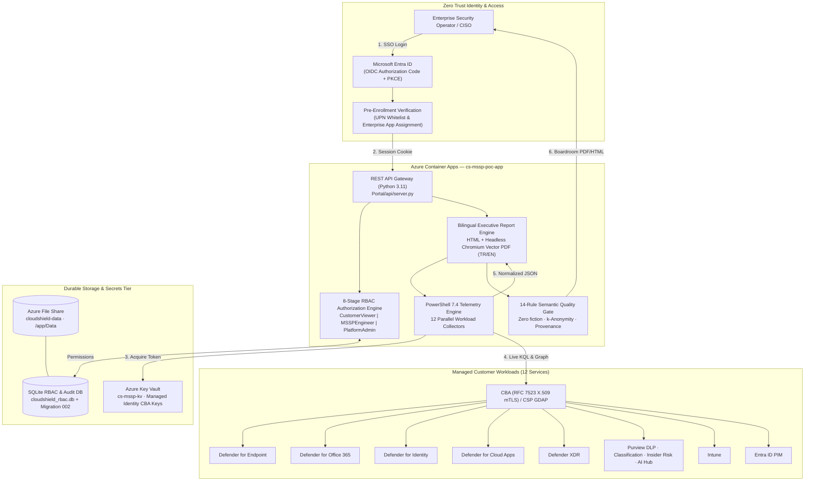

# CloudShield Enterprise MSSP Platform

[](https://github.com/canercetinkaya/cloudshield-mssp-portal)
[](https://cs-mssp-poc-app.icygrass-237b4292.westeurope.azurecontainerapps.io/)
[](SECURITY.md)
[](tests/)
[](tests/test_report_quality_gate.py)
[](https://github.com/canercetinkaya/cloudshield-mssp-portal/actions/workflows/ci-cd.yml)

**KoçSistem Microsoft Managed Security & Compliance Services** — an enterprise-grade, multi-tenant MSSP orchestration and executive reporting platform engineered for Microsoft Defender XDR and Microsoft Purview environments.

> **Live Portal:** [cs-mssp-poc-app.icygrass-237b4292.westeurope.azurecontainerapps.io](https://cs-mssp-poc-app.icygrass-237b4292.westeurope.azurecontainerapps.io/)  
> **Hosting:** Azure Container Apps · West Europe · `minReplicas=1` (zero cold-start) · `maxReplicas=3`

---

## Executive Value Proposition

CloudShield delivers four quantified pillars of business value to every managed customer tenant:

| Pillar | Capability | Business Outcome |
| :--- | :--- | :--- |
| **1. Autonomous Threat Mitigation** | Microsoft Defender XDR auto-blocks, ZAP, ASR enforcements | Threat containment without engineer intervention |
| **2. MSSP Engineering Excellence** | Deep configuration, policy tuning, DLP rule authoring, PIM governance | Senior engineer capacity augmentation |
| **3. Customer IT Enablement** | Approved remediation actions, self-service customer portal | IT team efficiency and ownership |
| **4. Shared Posture Intelligence** | 6-month trend lines, benchmark deltas, regulatory compliance posture | Board-level risk visibility and audit readiness |

Every report card and metric is traceable to a live Microsoft Graph API or KQL Advanced Hunting query — **zero static, hardcoded, or estimated figures**.

---

## System Architecture


```mermaid
flowchart TD
    subgraph Identity ["Zero Trust Identity & Access"]
        CISO["Enterprise Security Operator / CISO"]
        EntraID["Microsoft Entra ID\n(OIDC Authorization Code + PKCE)"]
        PreEnroll["Pre-Enrollment Verification\n(UPN Whitelist & Enterprise App Assignment)"]
    end

    subgraph ACA ["Azure Container Apps — cs-mssp-poc-app"]
        APIGateway["REST API Gateway (Python 3.11)\nPortal/api/server.py"]
        RBACEngine["8-Stage RBAC Authorization Engine\nCustomerViewer | MSSPEngineer | PlatformAdmin"]
        ReportEngine["Bilingual Executive Report Engine\nHTML + Headless Chromium Vector PDF (TR/EN)"]
        PSCollector["PowerShell 7.4 Telemetry Engine\n12 Parallel Workload Collectors"]
        QualityGate["14-Rule Semantic Quality Gate\nZero fiction · k-Anonymity · Provenance"]
    end

    subgraph Storage ["Durable Storage & Secrets Tier"]
        AzureFiles[("Azure File Share\ncloudshield-data · /app/Data")]
        SQLiteDB[("SQLite RBAC & Audit DB\ncloudshield_rbac.db + Migration 002")]
        KeyVault["Azure Key Vault\ncs-mssp-kv · Managed Identity CBA Keys"]
    end

    subgraph Tenants ["Managed Customer Workloads (12 Services)"]
        CBA["CBA (RFC 7523 X.509 mTLS) / CSP GDAP"]
        MDE["Defender for Endpoint"] & MDO["Defender for Office 365"]
        MDI["Defender for Identity"] & MDCA["Defender for Cloud Apps"]
        XDR["Defender XDR"] & Purview["Purview DLP · Classification · Insider Risk · AI Hub"]
        Intune["Intune"] & EntraPIM["Entra ID PIM"]
    end

    CISO -->|1. SSO Login| EntraID
    EntraID --> PreEnroll
    PreEnroll -->|2. Session Cookie| APIGateway
    APIGateway --> RBACEngine
    RBACEngine <-->|Permissions| SQLiteDB
    APIGateway --> ReportEngine
    ReportEngine --> PSCollector
    PSCollector -->|3. Acquire Token| KeyVault
    PSCollector -->|4. Live KQL & Graph| CBA
    CBA --> MDE & MDO & MDI & MDCA & XDR & Purview & Intune & EntraPIM
    PSCollector -->|5. Normalized JSON| ReportEngine
    ReportEngine --> QualityGate
    QualityGate -->|6. Boardroom PDF/HTML| CISO
    AzureFiles --- SQLiteDB
```

---

## Security Architecture at a Glance

| Control | Implementation |
| :--- | :--- |
| **Identity** | Microsoft Entra ID OIDC SSO · Authorization Code + PKCE · Assignment Required |
| **Pre-Enrollment Gate** | UPN whitelist verified in SQLite; non-enrolled users receive `403` after token validation |
| **Session Security** | `HttpOnly` · `Secure` · `SameSite=Lax` cryptographic session cookies |
| **Customer Auth** | Certificate-Based Auth (RFC 7523 X.509) or Microsoft CSP GDAP — **zero plaintext secrets** |
| **RBAC** | 8-stage `evaluate_access()` chain: Identity → Role → Customer Scope → Service Scope → Temporal → SoD → Audit |
| **Tenant Isolation** | `CustomerViewer` role: hard-walled to own tenant data only · `403 Forbidden` on cross-tenant calls |
| **Privacy-by-Design** | $k$-Anonymity ($k=5$) grouping + salted SHA-256 UPN/file masking for KVKK & GDPR |
| **Zero Fiction** | Missing sensors → `N/A` (never 100%); every metric bound to Catalog Query ID |
| **Audit Trail** | Append-only `audit_events` table; DENY/ALLOW + duration recorded for every API call |
| **Secret Scanning** | Gitleaks + TruffleHog + CodeQL SAST on every commit via GitHub Actions |

---

## Supported Workloads (12 Services)

| Service ID | Workload | Telemetry Sources |
| :--- | :--- | :--- |
| `SVC-MDE` | Microsoft Defender for Endpoint | `DeviceInfo`, `DeviceAlertEvents`, `DeviceTvmSoftwareVulnerabilities` |
| `SVC-MDO` | Microsoft Defender for Office 365 | `EmailEvents`, `EmailPostDeliveryEvents`, ZAP telemetry |
| `SVC-MDI` | Microsoft Defender for Identity | `IdentityLogonEvents`, `IdentityQueryEvents`, Lateral Movement |
| `SVC-MDCA` | Microsoft Defender for Cloud Apps | `CloudAppEvents`, `OAuthAppAuthorizations`, Shadow IT |
| `SVC-XDR` | Microsoft Defender XDR | `SecurityIncident`, `SecurityAlert`, Incident Evidence |
| `SVC-INTUNE` | Microsoft Intune | `DeviceManagement/managedDevices`, Compliance Policies |
| `SVC-ENTRA-PIM` | Entra ID Protection & PIM | `riskyUsers`, PIM Role Activations, Conditional Access |
| `SVC-PRV-DLP` | Microsoft Purview DLP | `Audit.General`, `DlpEvents`, `EndpointDlpActivity` |
| `SVC-PRV-CLASS` | Purview Information Protection | Sensitivity Labels, Trainable Classifiers, SIT Discovery |
| `SVC-PRV-GOV` | Purview Data Lifecycle | Retention Policies, Disposition Reviews, Records |
| `SVC-PRV-RISK` | Purview Insider Risk Management | Insider Risk Alerts, Exfiltration Indicators |
| `SVC-AI-SECURITY` | Microsoft Purview AI Hub | Copilot Interactions, GenAI Security, `AiInteractions` |

---

## Repository Layout

```
KocSistemMSSPPortal/
├── .github/                      # CI/CD, secret scanning, CodeQL, security policies
│   └── workflows/                # ci-cd.yml · secret-scanning.yml · codeql.yml · auto-deploy
├── Azure/                        # Infrastructure as Code (Bicep + ARM + deploy script)
├── config/                       # Service catalog, KPI catalog, permission catalog
├── Data/                         # Persistent: tenants.json, auth_config.json, RBAC DB
│   └── cloudshield_rbac.db       # SQLite DB with Migration 001 (RBAC schema) + 002 (historical trends)
├── database/                     # db.py connection manager + versioned SQL migrations
├── Docker/                       # Multi-stage production Dockerfile
├── docs/                         # Architecture, compliance, reviews, governance
├── Engine/                       # PowerShell 7.4 Telemetry Engine
│   ├── Core/                     # Authentication (CBA/GDAP), DPAPI, PrivacyEngine, PluginLoader
│   └── Plugins/                  # 12 Workload Collector Modules (*.Plugin.psm1)
├── Portal/
│   ├── api/                      # Python 3.11 REST API, RBAC engine, report generator
│   └── web/                      # Single-page app (Tailwind CSS, Vanilla JS, Lucide)
├── Scripts/                      # Tenant onboarding, local dev, GitHub sync
├── tests/                        # 54 unit + 59 QA automated tests
├── ARCHITECTURE.md               # Master architecture spec & Mermaid diagrams
├── DEPLOYMENT.md                 # Azure & Docker deployment guide
├── SECURITY.md                   # Vulnerability disclosure & Zero Trust policy
└── version.json                  # Single source of version truth (v3.0.0-ENTERPRISE)
```

---

## Local Quick Start

### Prerequisites
- Python 3.11+ · PowerShell 7.4+ · Microsoft Edge or Chrome

### 1. Bootstrap & Run
```powershell
# Initialize database and run tests
pwsh ./Scripts/setup_project.ps1

# Launch local portal at http://localhost:8080
pwsh ./Scripts/Start-LocalPortal.ps1 -Port 8080
```

### 2. Run Test Suites
```powershell
# 54 unit & authorization tests
python -m unittest discover tests

# 59-test end-to-end platform QA
python tests/test_comprehensive_qa.py
```

### 3. Safe GitHub Sync
```powershell
pwsh ./Scripts/Sync-ToGitHub.ps1 -Message "feat: your change description"
```

---

## Compliance & Legal

- **KVKK / GDPR:** Privacy-by-Design with mathematical $k=5$ anonymity and cryptographic audit trail.
- **ISO 27001:** Append-only audit log, Separation of Duties, Least Privilege Graph API scopes.
- **Zero Hardcoded Credentials:** Enforced via Gitleaks, TruffleHog, and CodeQL on every commit.
- **Principle of Least Privilege:** Graph permissions scoped to read-only security workloads only.

---

Copyright &copy; 2026 **KoçSistem Microsoft Managed Security & Compliance Services**. All Rights Reserved.  
Proprietary and Confidential. Unauthorized reproduction, modification, or distribution is strictly prohibited.
