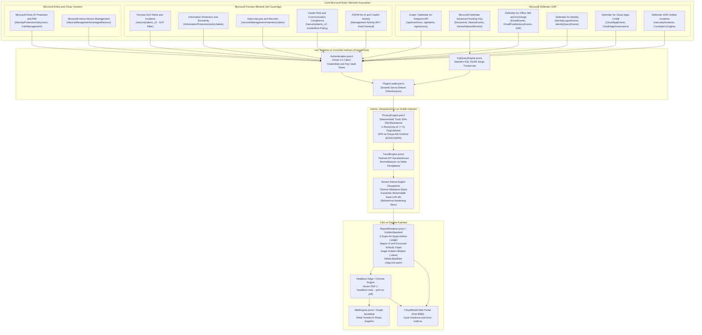

# CloudShield MSSP Platform: Reporting Architecture & Telemetry Map

Bu belge, **CloudShield MSSP Güvenlik ve Uyum Raporlama Platformu**'nun veri toplama mimarisini, bağlandığı Microsoft bulut API'lerini, Advanced Hunting KQL tablolarını, veri dönüştürme ve gizlilik (PrivacyEngine) adımlarını ve A4 vektörel rapor üretim haritasını ayrıntılı olarak açıklar.

---

## 1. Uçtan Uca Raporlama Mimarisi & Veri Akış Haritası

Aşağıdaki Mermaid diyagramı, müşterinin canlı Microsoft bulut ortamından çekilen ham telemetrinin nasıl işlenip CISO seviyesinde A4 vektörel PDF ve interaktif HTML rapora dönüştüğünü gösterir:

---

## 2. Rapor Türleri ve Veri Bağlantı Matrisi

Platformdaki raporlar gereksiz parçalanmalardan arındırılarak **8 Temel Yönetilen Hizmet Raporu** ve **1 Birleşik Konsolide Rapor** olarak sadeleştirilmiştir:

### 1. Microsoft Defender for Endpoint (MDE) - Yönetilen EDR Raporu
- **Hizmet Kodu:** `SVC-MDE`
- **Hedef API:** Microsoft Graph (`v1.0`), Defender Security Center REST API (`/api/machines`, `/api/alerts`, `/api/machineactions`).
- **KQL Advanced Hunting Tabloları:**
  - `DeviceInfo`: Sensör durumu, OS platformu, aktiflik/hayalet (ghost) cihazlar.
  - `DeviceAlertEvents`: EDR tarafından engellenen ve temizlenen zararlılar.
  - `DeviceEvents`: ASR (Attack Surface Reduction) kural engellemeleri, kurcalama (tamper) girişimleri.
  - `DeviceProcessEvents`: Şüpheli PowerShell, mimikatz, olağandışı konumlardan çalıştırılan ikili dosyalar.
  - `DeviceNetworkEvents`: C2 (Komuta Kontrol) ve script host kaynaklı dış bağlantılar.
- **Odaklandığı Temel Metrikler:**
  - Otonom engellenen tehdit adedi ve kazanılan analist zamanı (saat).
  - Sensör sağlığı, pasif/hayalet cihaz envanteri, antivirüs tarama tazeliği.
  - Fidye yazılımı (ransomware) ilişkili bulgular ve izole edilen cihazlar.
  - ASR kural aktivitesi, güvenlik konfigürasyon uyumu (% TVM) ve sertleştirme trendi.

### 2. Microsoft Defender for Office 365 (MDO) - Yönetilen E-Posta Güvenliği Raporu
- **Hizmet Kodu:** `SVC-MDO`
- **Hedef API:** Microsoft Graph Security Alerts v2, Exchange Online Protection API, Security & Compliance PowerShell.
- **KQL Advanced Hunting Tabloları:**
  - `EmailEvents`: Gelen/giden toplam posta trafiği, SPF/DKIM/DMARC doğrulama durumları.
  - `EmailPostDeliveryEvents`: ZAP (Zero-Hour Auto Purge) ile teslim sonrası otonom geri çekilen e-postalar.
  - `EmailAttachmentInfo`: Kötü amaçlı ekler (Safe Attachments derin inceleme bulguları).
  - `EmailUrlInfo`: Safe Links tıklama anı koruması, engellenen kimlik avı (phishing) bağlantıları.
- **Odaklandığı Temel Metrikler:**
  - Kimlik avı (phishing), BEC (Business Email Compromise) ve sahte fatura engellemeleri.
  - ZAP otonom müdahale oranı ve kullanıcı posta kutusundan geri çekilen zararlılar.
  - Kullanıcı bildirimli şüpheli e-postalar (User Submissions) ve analist teyit oranı.

### 3. Microsoft Defender for Identity (MDI) - Yönetilen Kimlik Tehdit Koruması Raporu
- **Hizmet Kodu:** `SVC-MDI`
- **Hedef API:** Microsoft Defender XDR Identity Hunting, Graph Security Alerts v2.
- **KQL Advanced Hunting Tabloları:**
  - `IdentityLogonEvents`: Şüpheli Kerberos bilet talepleri (Golden/Silver Ticket, Kerberoasting), NTLM düşürme saldırıları.
  - `IdentityDirectoryEvents`: Hassas Active Directory grup üyelik değişiklikleri, DCShadow, DCSync girişimleri.
  - `IdentityQueryEvents`: Şüpheli LDAP keşifleri (BloodHound / AdFind izleri).
- **Odaklandığı Temel Metrikler:**
  - DC sensör sağlığı ve kapsanan etki alanı denetleyicileri.
  - Yanal hareket yolları (Lateral Movement Paths) ve hesap ele geçirme (Account Takeover) göstergeleri.
  - Şüpheli kimlik bilgisi hırsızlığı alarmları.

### 4. Microsoft Defender for Cloud Apps (MDCA) - Yönetilen Bulut Güvenliği Raporu
- **Hizmet Kodu:** `SVC-MDCA`
- **Hedef API:** Defender for Cloud Apps Discovery API, Microsoft Graph CloudAppSecurity.
- **KQL Advanced Hunting Tabloları:**
  - `CloudAppEvents`: Shadow IT bulut kullanımı, olağandışı dosya indirme/silme hacimleri.
  - `OAuthAppGovernance`: Şüpheli izinlere sahip üçüncü taraf OAuth uygulamaları, izin kötüye kullanımı.
- **Odaklandığı Temel Metrikler:**
  - Keşfedilen toplam SaaS uygulaması ve yüksek riskli (un-sanctioned) uygulamalar.
  - Veri sızdırma anomalileri (Impossible travel, toplu dışa aktarma).
  - Hassas izinlere sahip onaylanmamış OAuth uygulamaları.

### 5. Microsoft Defender XDR - Yönetilen Bütünleşik Olay ve MTTR Raporu
- **Hizmet Kodu:** `SVC-XDR`
- **Hedef API:** Microsoft Graph `/security/incidents`, Incident Correlation Engine.
- **KQL Advanced Hunting Tabloları:**
  - `SecurityIncident`: Uç nokta, e-posta, kimlik ve bulut alarmlarını birleştiren üst olaylar.
  - `AlertEvidence`: Olaylara bağlı kanıtlar (hesaplar, IP'ler, cihazlar, dosyalar).
- **Odaklandığı Temel Metrikler:**
  - Korele edilmiş toplam incident sayısı, ciddiyet dağılımı (High, Medium, Low, Informational).
  - MTTA (Ortalama İlk Müdahale Süresi) ve MTTR (Ortalama Çözümleme Süresi).
  - True Positive / False Positive doğruluk oranları ve otomatik kapatılan alarmlar.

### 6. Microsoft Intune - Yönetilen Cihaz Uyum ve Hijyen Raporu
- **Hizmet Kodu:** `SVC-INTUNE`
- **Hedef API:** Microsoft Graph `/deviceManagement/managedDevices`, Device Configuration States.
- **Odaklandığı Temel Metrikler:**
  - MDM yönetilen cihaz sayısı ve platform dağılımı (Windows, macOS, iOS, Android).
  - Uyumluluk (Compliance) politikalarına uyum oranı ve uyumsuz cihaz nedenleri.
  - Disk şifreleme (BitLocker / FileVault) kapsamı ve işletim sistemi sürüm hijyeni.

### 7. Microsoft Entra ID - Yönetilen Kimlik Koruması ve PIM Raporu
- **Hizmet Kodu:** `SVC-ENTRA-ID`
- **Hedef API:** Microsoft Graph Identity Protection (`/identityProtection/riskyUsers`, `/identityProtection/riskDetections`), PIM Role Management (`/roleManagement/directory/roleAssignmentScheduleInstances`).
- **Odaklandığı Temel Metrikler:**
  - Riskli kullanıcılar ve riskli oturum açma olayları (Atypical travel, password spray, leaked credentials).
  - PIM ayrıcalıklı rol aktivasyon sıklığı, süre aşımları ve onay denetimleri.
  - Kalıcı Global Admin hijyeni ve MFA (Çok Faktörlü Kimlik Doğrulama) kapsama oranı.

### 8. Microsoft Purview - Yönetilen Veri Güvenliği ve Uyum Raporu (BİRLEŞİK TEK RAPOR)
- **Hizmet Kodu:** `SVC-PURVIEW`
- **Mimari Gerekçe:** Kurumsal operasyonlarda Microsoft Purview tek bir yönetilen hizmet sözleşmesi olarak teslim edilir. Veri kaybı önleme (DLP), hassas veri sınıflandırma, saklama/imha, iç tehditler ve yapay zeka güvenliği birbirini tamamlayan aynı veri yönetişimi bütününün parçalarıdır.
- **Hedef API'ler ve Kaynaklar:**
  - **DLP Olayları:** Graph Security Alerts v2 (`ServiceSource: Microsoft Purview DLP`), Exchange, SharePoint, OneDrive, Teams ve Endpoint DLP engellemeleri.
  - **Veri Sınıflandırması:** `/informationProtection/policy/labels`, Hassas Bilgi Türleri (SIT), etiketleme oranları.
  - **Veri Yaşam Döngüsü:** `/recordsManagement/retentionLabels`, imha incelemeleri ve saklama politikaları.
  - **İç Tehdit (Insider Risk):** Insider Risk Management politika uyarıları (k-anonymity ile maskelenmiş).
  - **DSPM for AI / Copilot:** Microsoft 365 Copilot etkileşim logları, LLM'lere yönlendirilen hassas veri denetimi.
- **Odaklandığı Temel Metrikler:**
  - Engellenen toplam DLP ihlali (USB kopyalama, buluta yükleme, harici e-posta, yazdırma).
  - Şirket içi hassas veri etiketleme kapsamı ve otomatik sınıflandırma başarısı.
  - Copilot etkileşimlerinde saptanan ve korunan hassas veri hacmi.
  - KVKK / GDPR denetim izi ve k-Anonymity güvencesi.

---

## 3. Standart A4 Şablonu (Golden Standard Mimarisi)

Raporlama motorumuz, aşağıdaki A4 kurumsal şablon mimarisini kullanır:

```mermaid
graph TD
    subgraph Page1 ["Sayfa 1: Yonetici Ozeti and Deger Katmani"]
        H1["Kurumsal Baslik (Cift Logo: Musteri Sol, MSSP Sag)"]
        Summary["Yonetici Ozeti (Tehdit ve Cihaz Sayilari Ozeti)"]
        ValCards["Metrik Kartlari: Otonom Tehdit | Kazanilan Zaman | Analist Mudahalesi"]
        ValueStory["MSSP Yonetilen Hizmet Degeri:<br/>1. Otomasyon Katmani (MSSP Yapilandirdi)<br/>2. Analist Mudahalesi (MSSP Ekibi)<br/>3. Yapilandirma ve Iyilestirme (Muhendislik Eforu)"]
        Flags["Dikkat Gerektiren Basliklar (flag crit / warn / ok)"]
        Scope["Kapsam, Sensor Sagligi and OS Dagilimi"]
        Foot1["Damga: Sayfa 1 / 3"]
    end

    subgraph Page2 ["Sayfa 2: Tehdit Korumasi and Olay Analizi"]
        H2["Ust Bilgi: Tehdit ve Olay Ozeti"]
        KpiTable["Tehdit Korumasi KPI Tablosu (Engellenen, Phishing, Exploit, ASR, Fidye)"]
        IncDist["Incident Siddet Dagilimi and En Cok Gorulen Tehditler"]
        Mitre["MITRE ATT&CK Dagilimi and Tehdit Kategorileri"]
        TopAlerts["En Cok Tetiklenen Alarmlar and En Cok Alert Ureten Cihazlar"]
        IncTable["Donemdeki Olaylar (Incident Listesi)"]
        RecentAlerts["Son Alarmlar Tablosu"]
        Foot2["Damga: Sayfa 2 / 3"]
    end

    subgraph Page3 ["Sayfa 3: Tehdit Avciligi and Hizmet Faaliyetleri"]
        H3["Ust Bilgi: Tehdit Avciligi ve Hizmet Faaliyetleri"]
        HuntTable["Advanced Hunting Bulgulari (Supheli Komut, Dis Baglanti, Servis Kurulumu)"]
        Tamper["Korumaya Mudahale (Tamper) and ASR Kural Aktivitesi"]
        Hardening["Sikilastirma (Hardening) Yolculugu Trendi and Uyumsuz Ayarlar"]
        Hygiene["Ajan Hijyeni and Antivirus Haric Tutma Degisiklikleri"]
        Actions["Yonetilen Hizmet Faaliyetleri (Izole Cihaz, Aksiyon Basarisi, IoC Envanteri)"]
        Compliance["KVKK and GDPR Kriptografik Denetim Izi and Gizlilik Taahhudu"]
        Foot3["Damga: Sayfa 3 / 3 | v6.0 Golden Standard"]
    end

    Page1 --> Page2 --> Page3
```

---

## 4. Sürekli Güncellik ve Doğrulama Taahhüdü

Bu mimari harita, `Engine/Config/service-catalog.json` dosyasındaki servis tanımları veya eklentiler her güncellendiğinde otomatik QA doğrulama paketimiz (`test_comprehensive_qa.py`) ile test edilir ve senkronize tutulur.
