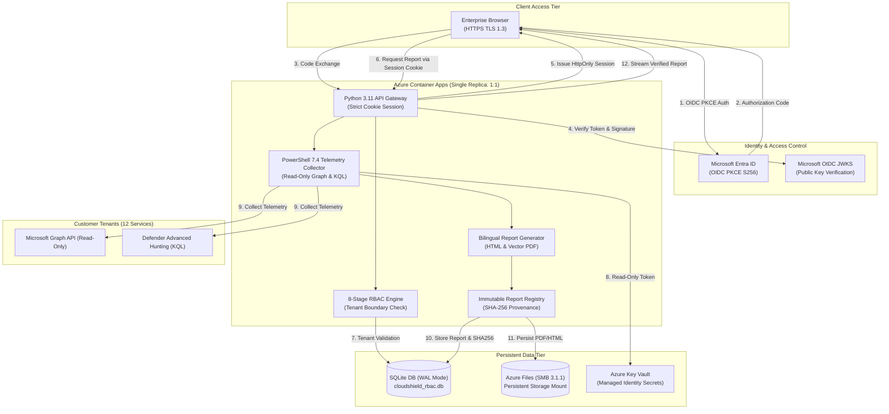

# CloudShield Security Reporting & Managed Services Visibility Platform
## Strategic Product Repositioning & Architecture Blueprint (v3.1.0)

---

### 1. Executive Summary & New Product Positioning

**CloudShield** has been strategically repositioned away from being a full-scope MSSP SOC platform, SIEM alternative, SOAR orchestrator, or incident response workbench.

The definitive, production-focused product charter is:

> **"CloudShield Security Reporting & Managed Services Visibility Platform"**

#### Core Objective
To provide enterprise organizations consuming Microsoft Managed Security & Compliance Services with:
1. **Verifiable Data Collection:** Read-only, least-privilege telemetry collection from Microsoft Defender and Microsoft Purview workloads across multiple customer tenants.
2. **Customer-Isolated Visibility:** Dedicated, cryptographically segregated dashboards that present clean, actionable security posture intelligence without cross-tenant leakage.
3. **Monthly Managed Service Reports:** Boardroom-ready, bilingual (Turkish/English) executive summaries and comprehensive technical scorecards.
4. **Service Value Attribution:** Hard metric evidence proving the tangible return on investment (ROI) delivered by managed services (e.g., autonomous blocks, policy tuning, engineering hours saved).
5. **Automated Report Generation & Delivery:** Scheduled generation and secure email dispatch backed by an immutable, SHA-256 validated report registry.
6. **Provenance & Auditability:** Zero-fiction telemetry bindings ensuring every chart, metric, and finding traces back to an authentic Graph API call or KQL Advanced Hunting query.

---

### 2. Workload & Service Scope (Phase 1 Target Matrix)

The platform supports the following 12 managed service workloads across the Microsoft Defender and Microsoft Purview suites:

| Category | Service ID | Service Display Name | Key Managed Telemetry & Capabilities |
| :--- | :--- | :--- | :--- |
| **Endpoint** | `SVC-MDE` | Microsoft Defender for Endpoint | Device inventory, sensor health, ASR rules, TVM vulnerabilities, automated isolation actions |
| **Email & Collab** | `SVC-MDO` | Microsoft Defender for Office 365 | Phishing/Malware blocks, Zero-Hour Auto Purge (ZAP), safe links/attachments, spoofing posture |
| **Identity** | `SVC-MDI` | Microsoft Defender for Identity | Kerberos attacks, Pass-the-Hash/Ticket, honeytoken anomalies, lateral movement paths |
| **Cloud Apps** | `SVC-MDCA`| Microsoft Defender for Cloud Apps | Shadow IT discovery, OAuth app governance, risky cloud transactions, SaaS usage posture |
| **Cloud Posture**| `SVC-MDC` | Microsoft Defender for Cloud | Multi-cloud CSPM, Secure Score evolution, CWPP server/container protections |
| **Unified XDR** | `SVC-XDR` | Microsoft Defender XDR | Unified incident correlation, MTTA/MTTR resolution velocity, cross-domain attack story |
| **Endpoint Mgmt**| `SVC-INTUNE`| Microsoft Intune | Managed device compliance, BitLocker/FileVault encryption hygiene, OS version freshness |
| **Identity Gov** | `SVC-ENTRA-PIM`| Microsoft Entra ID PIM | Privileged role activations, permanent Global Admin elimination, risky user tracking |
| **Data Security**| `SVC-PRV-DLP`| Microsoft Purview DLP | Sensitive Info Type (SIT) violations, USB/Cloud/Print exfiltration blocks, policy overrides |
| **Classification**| `SVC-PRV-CLASS`| Purview Info Protection & SITs | Sensitivity label adoption, trainable classifier coverage, automated discovery |
| **Lifecycle & DSPM**| `SVC-PRV-GOV`| Purview Data Lifecycle & DSPM | Data Security Posture Management (DSPM), retention policies, disposition reviews |
| **Insider Risk** | `SVC-PRV-RISK`| Purview Insider Risk Management | Exfiltration indicators, privacy-safe $k=5$ k-anonymity aggregation, Comm Compliance |
| **AI Posture** | `SVC-AI-SECURITY`| Purview DSPM for AI & Copilot | Microsoft Copilot security, GenAI sensitive data routing, synthetic AI risk alerts |

---

### 3. Implementation Priorities

#### P0: Security, Isolation & Provenance (Production Blocking — 100% Completed)
- **Tenant Isolation:** Enforced via 8-stage RBAC engine; customer viewers are strictly restricted to their own tenant identifier.
- **Authentication & OIDC:** Microsoft Entra ID Authorization Code Flow with PKCE S256; fail-closed JWKS validation with RSA256 signature verification.
- **Session Security:** Cryptographically random session IDs stored server-side; delivered exclusively via `HttpOnly`, `Secure`, `SameSite=Strict`, `Path=/` cookies. Zero tokens in URLs or `localStorage`.
- **Report Ownership & Registry:** Reports are registered in an immutable SQLite table (`report_registry`) with SHA-256 file hashes; downloads occur via registry ID with strict tenant ownership validation.
- **Data Integrity & Provenance:** Zero synthetic/mock data in live customer reports; missing telemetry yields transparent "N/A" indicators rather than fabricated figures.
- **Auditability:** Append-only audit logging recording every authorization decision, user identity, IP address, and response duration.

#### P1: Portal UX & Reporting Operations (Active Operational Scope)
- **Portal Realignment:** Re-branded topbar, cockpit banners, and navigation tabs focusing squarely on "Security Reporting & Managed Services Visibility".
- **Service-Specific Views:** Dedicated dashboard widgets and filter controls for MDE, MDO, MDI, MDCA, MDC, Intune, and Purview modules.
- **Monthly Reporting Workflow:** One-click and scheduled batch generation of monthly executive reports.
- **Scheduler & Delivery:** Integrated scheduler for automated report rendering and encrypted email dispatch to authorized customer distribution lists.
- **Executive Value Dashboards:** Single-tenant view showcasing the 4 Value Pillars (Autonomous Blocks, MSSP Engineering Hours Saved, IT Actions, Posture Elevation).

#### P2: Infrastructure Hardening & Scalability (Platform Assurance)
- **Azure Container Apps Single-Replica Constraint:** Locked to `minReplicas=1, maxReplicas=1` while running on SQLite + Azure Files, ensuring zero database locking conflicts and serialized WAL transactions.
- **DevSecOps Automation:** GitHub Actions workflows incorporating TruffleHog, Gitleaks, CodeQL SAST, and automated quality gates on every pull request.
- **Scalable Database Blueprint:** Documented migration path to Azure Database for PostgreSQL Flexible Server for post-pilot multi-replica scaling.

---

### 4. Roadmap Parking Lot (Explicitly Deferred Scope)

To maintain focus and prevent operational sprawl, the following features are formally moved to the post-pilot roadmap:

1. **SOC Operations & Triage Cockpit:** Real-time alert streaming, analyst shift handover logs, and live triage queues.
2. **Case Management:** Ticket creation, escalation trees, and SLA tracking for incident lifecycle handling.
3. **SOAR (Security Orchestration, Automation and Response):** Automated playbooks executing intrusive write actions on customer tenants.
4. **Sentinel Replacement:** Custom SIEM log ingestion, storage lakes, and general log querying.
5. **Incident Response Workflows:** Active threat containment, host isolation commands, and evidence preservation beyond read-only telemetry.
6. **Analyst Workbench:** Interactive investigation consoles and memory dump analysis.

---

### 5. Architectural Guardrails for Controlled Pilot

---

### 6. Controlled Pilot Readiness Verdict

**Verdict:** **GO WITH CONDITIONS**

#### Operational Conditions for Pilot Deployment:
1. **Replica Count:** `minReplicas=1` and `maxReplicas=1` must be strictly maintained in the Azure Container App configuration.
2. **Database Mode:** SQLite must operate with `PRAGMA journal_mode=WAL` and `PRAGMA busy_timeout=5000`.
3. **Authentication:** All pilot users must authenticate via Entra ID OIDC SSO with PKCE S256. Local developer login is disabled by default.
4. **Key Vault Access:** Container App Managed Identity must have minimal read-only secret/certificate permissions (`Key Vault Secrets User`) through Private Endpoints or restricted VNet service endpoints.
5. **Report Access:** All report downloads must resolve through `/api/reports/{id}/download` validated against the tamper-evident registry.
