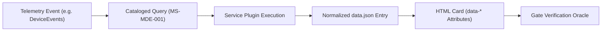

# CloudShield MSSP Platform - KPI Provenance & Telemetry Lineage

**Document Version:** 2.0.0  
**Classification:** Technical Architecture Specification  

---

## 1. Provenance Architecture

Customer trust requires every displayed number to be traceable back to its originating query, permission scope, and collection timestamp. The CloudShield platform enforces cryptographic and operational telemetry lineage on every metric.

### KPI Provenance Attributes
Every metric rendered in an executive card emits machine-readable metadata attributes:

```html
<div class="card" 
     data-kpi-id="KPI-MDE-001" 
     data-source-query="MS-MDE-001" 
     data-origin="MDE DeviceInventory" 
     data-collection-status="SupportedAppOnly"
     data-period="2026-08">
  <span>Aktif Sensör Kapsam Oranı <span class="pill p-ok">97.0%</span></span>
  <b>97.0 <small>%</small></b>
  <span class="kpi-prov">Kaynak: MDE DeviceInventory &bull; Durum: SupportedAppOnly</span>
</div>
```

---

## 2. Lineage Verification Chain



### Validation Rules:
1. **Catalog Resolution:** `data-source-query` must resolve to an authentic entry in `Engine/KQL/query-metadata/catalog-index.json`. Ad-hoc strings are rejected.
2. **Permission Alignment:** The query's `requiredPermissions` must match the minimum scopes declared in `docs/security/permission-matrix.md`.
3. **Period Concurrency:** Telemetry event timestamps must fall strictly within the declared report cycle (`2026-08-01T00:00:00Z` to `2026-08-31T23:59:59Z`).
