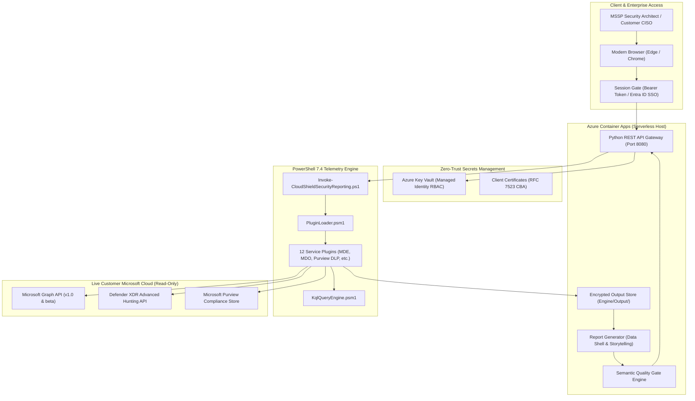
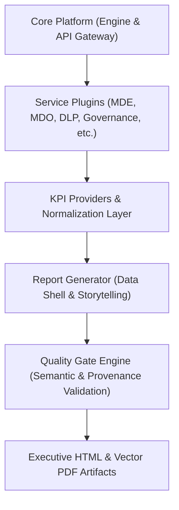

# CloudShield MSSP Platform - System Architecture

**Document Version:** 2.0.0  
**Classification:** Internal Technical Architecture  
**Runtime Environment:** Azure Container Apps (Serverless) | Python 3.11 | PowerShell 7.4  

---

## 1. Architectural Overview

CloudShield is an enterprise-grade managed security and compliance reporting product engineered for **KoçSistem Managed Security Service Provider (MSSP)** operations. It interfaces directly with Microsoft Defender XDR and Microsoft Purview across multi-tenant client environments to produce executive-ready C-Level briefings, technical compliance scorecards, and verifiable threat posture reports.

The platform operates on a **Dual-Engine Architecture**:
1. **API Gateway & Presentation Engine (Python 3.11):** Lightweight HTTP REST service (`Portal/api/server.py`) and authoritative report generation engine (`Portal/api/report_generator.py`) that constructs responsive HTML and vector A4 PDF reports.
2. **Telemetry Ingestion & Plugin Engine (PowerShell 7.4):** Modular collector framework (`Engine/Invoke-CloudShieldSecurityReporting.ps1`) executing granular Microsoft Graph API queries and Advanced Hunting KQL scripts.

---

## 2. Multi-Service Core Architecture

The platform architecture decouples data collection from executive presentation. Service modules communicate through normalized schema contracts (`data.json`) and formal catalogs:

---

## 3. Key Design Principles

1. **100% Dynamic Data Shell:** Reports contain zero hardcoded metrics or hallucinated dollar savings. When telemetry is absent, the system renders a verified clean state or explicit data-gap disclosure.
2. **Four-Pillar Value Attribution:** Distinguishes machine automation from human engineering, customer governance, and shared outcomes.
3. **Four-Quadrant Decision Framework:** Structures recommendations into actionable boardroom categories (Approved, Pending, Deferred, Recommended).
4. **Least-Privilege GDAP Model:** Zero administrative write permissions. All integrations utilize read-only Graph/MDE scopes.
