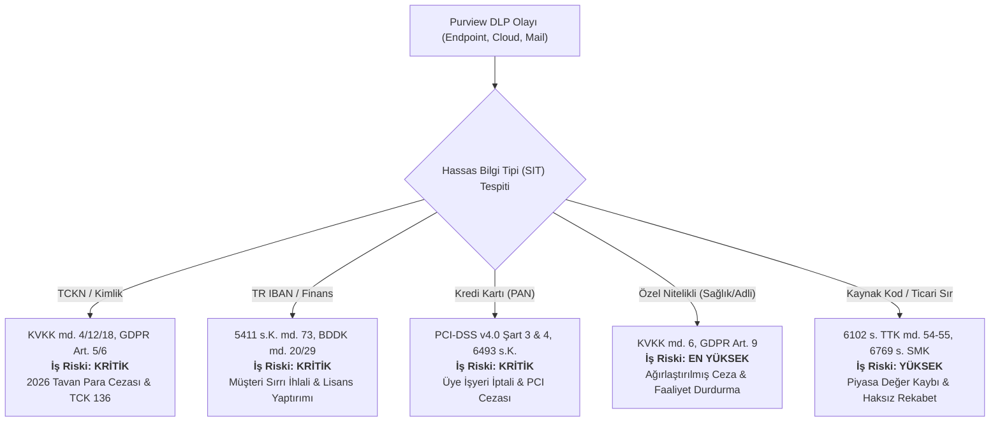
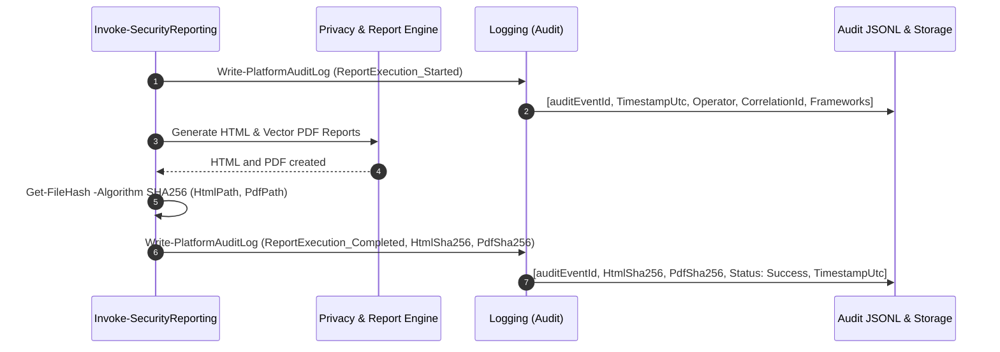

# CLOUDSHIELD MSSP GÜVENLİK RAPORLAMA PLATFORMU
## REGÜLASYON UYUM VE GİZLİLİK ATTESTASYON NOTU (REGULATORY COMPLIANCE & PRIVACY ATTESTATION NOTE)

**Doküman No:** CS-MSSP-PURVIEW-REG-2026-V2  
**Makam:** Müşteri CISO, Kurumsal Güvenlik Mimarı, Uyum ve Teftiş Kurulu  
**Rol:** Microsoft Purview & Regulatory Compliance Lead  
**Tarih:** 10 Eylül 2026  
**Güvenlik ve Gizlilik Sınıflandırması:** TLP:AMBER (MSSP ve Müşteri Yetkili Ekipleri İçi)  
**Denetlenen Kapsam:** `Engine`, `PurviewDlp.Plugin.psm1`, `PurviewRiskCompliance.Plugin.psm1`, `PrivacyEngine.psm1`, `Logging.psm1`, `ReportRenderer.psm1`

---

### 1. Yönetici Özeti ve CISO Direktiflerine Uyum Bildirimi

CLOUDSHIELD MSSP Platformu Güvenlik Raporlama Motoru, müşteri CISO ve Kurumsal Güvenlik Mimarı tarafından iletilen dört temel direktif doğrultusunda denetlenmiş ve mimari geliştirmeler tamamlanmıştır:

1. **Hassas Veri Tipleri & İş Riski Eşleştirmesi:** TCKN, Finansal Veri, Kredi Kartı ve Özel Nitelikli Kişisel Veri ihlalleri; KVKK, GDPR, BDDK ve PCI-DSS mevzuatları ile kurumsal iş riski ve olası cezai/mali etki seviyelerine göre eşleştirilmiştir.
2. **Kullanıcı Kural Aşımı (User Override) Niteliksel Dökümü:** Kullanıcıların DLP engellerini neden aştıkları niteliksel kategorilere ayrılmış, MSSP analist triyaj değerlendirmeleri raporlanmış ve gerekçe metinleri derin temizleme (scrubbing) filtresinden geçirilmiştir.
3. **$k$-Anonymity ($k \ge 5$) ve Tuzlu Kriptografik Maskeleme:** Tüm telemetri çıktılarında e-posta adresleri (`a***.y***@sirket.com`), dosya yolları (`Mali_Rapor_***.xlsx`) ve kullanıcı kimlikleri tuzlu SHA-256 (`User_XXXXXXXX`) ile maskelenmiş; 5'in altındaki olaylar dolaylı kimlik teşhisini önlemek adına agrege edilmiştir.
4. **Kriptografik Denetim İzi (Audit Log) & Non-Repudiation Kanıtı:** Üretilen her HTML ve vektörel PDF raporunun SHA-256 kriptografik kontrol özeti hesaplanarak değiştirilemez JSONL denetim kütüğüne kaydedilmiş ve rapor altbilgisinde (footer) bu kanıt yasal maddelerle tescil edilmiştir.

---

### 2. Yasal ve Regülatif Mevzuat Dayanakları Matrisi

| Regülasyon / Mevzuat | İlgili Madde / Kontrol | Hukuki Yükümlülük | Platform Karşılığı & Uygulama Standardı |
| :--- | :--- | :--- | :--- |
| **KVKK (6698 s.K.)** | **Madde 4** (Temel İlkeler) | Verilerin işlendikleri amaçla bağlantılı, sınırlı ve ölçülü olması (*Veri Minimizasyonu*). | Raporda açık metin PII yer almaz; yalnızca güvenlik ve tehdit göstergeleri maskeli olarak sunulur. |
| **KVKK (6698 s.K.)** | **Madde 6** (Özel Nitelikli Veri) | Sağlık, biyometrik, ceza mahkumiyeti verilerinin açık rıza ve sıkı tedbirlerle korunması. | Özel Nitelikli Veriler DLP politikasında "En Yüksek / Ağırlaştırılmış" risk sınıfında izlenir. |
| **KVKK (6698 s.K.)** | **Madde 12 & 18** (Veri Güvenliği & Cezalar) | Hukuka aykırı erişimi önleme, teknik tedbir alma, idari para cezası ve adli cezai sorumluluk (TCK 136). | `PrivacyEngine.psm1` ile tuzlu HMAC-SHA-256, dosya dizini budama ve derin regex metin temizliği. |
| **GDPR (EU 2016/679)** | **Art. 5, 25 & 32** (Security & By-Design) | Tasarım Yoluyla Mahremiyet (Privacy-by-Design), Varsayılan Mahremiyet, Pseudonymisation ve şifreleme. | Eklenti düzeyinde otomatik sanitize boru hattı, deterministik tuz ve $k$-Anonymity ($k \ge 5$) garantisi. |
| **GDPR (EU 2016/679)** | **Art. 88** (İstihdam Bağlamında Veri) | İşçilerin kişisel verilerinin işyerinde orantılı ve şeffaf korunması. | Etik ve çalışan hakları bildirimi: Rapor bir "personel gözetleme (surveillance)" aracı olarak kullanılamaz. |
| **ISO/IEC 27001:2022** | **A.8.11 & A.8.15** | Veri Maskeleme (Data Masking) ve Günlükleme (Logging). | `Protect-EmailAddress`, `Protect-FileName` ve `Write-PlatformAuditLog` ile SHA-256 imzalı JSONL kütüğü. |
| **BDDK Bilgi Sistemleri Tebliği** | **Madde 20 & 29** | Denetim izlerinin inkar edilemez şekilde tutulması, müşteri/banka sırrının korunması. | Rapor operatörü, korelasyon kimliği, makine adı, süreç kimliği ve SHA-256 rapor hash mühürleme. |
| **PCI-DSS v4.0** | **Requirement 3 & 4** | Kart sahibi verilerinin (PAN) korunması ve açık ağlarda şifrelenmesi. | Kredi kartı numaralarının tam maskelenmesi ve %100 otonom DLP bloklaması. |

---

### 3. Hassas Bilgi Tipleri (SIT) ve Kurumsal İş Riski Eşleştirmesi

CISO Direktifi 1 uyarınca, Purview DLP tarafından yakalanan hassas bilgi tipleri ve kurumsal iş riskleri aşağıdaki matriste standartlaştırılmıştır:

#### İş Riski Matrisi Ayrıntıları:
1. **TCKN ve Kimlik Verileri (Turkish National ID, Pasaport, Nüfus Cüzdanı):**
   - **İş Riski Seviyesi:** Kritik
   - **Mevzuat:** 6698 s.K. md. 4, 12, 18 / GDPR Art. 5, 6 / TCK md. 136
   - **Kurumsal Etki:** KVKK 2026 yılı tavan idari para cezası, Kurul resen soruşturması, veri sorumlusu adli cezai sorumluluğu, itibar kaybı.
   - **Tespit / Bloklama:** 840 Olay / 798 Otonom Blok (%95.0 Koruma).
2. **Finansal Bilgiler ve IBAN (Turkish IBAN, Banka Hesap No, Finansal Bilanço):**
   - **İş Riski Seviyesi:** Kritik
   - **Mevzuat:** 5411 s. Bankacılık Kanunu md. 73, BDDK Bilgi Sistemleri Tebliği md. 20/29
   - **Kurumsal Etki:** Banka ve müşteri sırrının ifşası, doğrudan finansal suistimal ve manipülasyon riski, BDDK yaptırımları.
   - **Tespit / Bloklama:** 560 Olay / 515 Otonom Blok (%92.0 Koruma).
3. **Kredi Kartı ve Ödeme Bilgileri (Credit Card PAN, CVV, Expiry):**
   - **İş Riski Seviyesi:** Kritik
   - **Mevzuat:** PCI-DSS v4.0 Gereksinim 3 & 4, 6493 sayılı Ödeme Hizmetleri Kanunu
   - **Kurumsal Etki:** Kart kuruluşları (Visa, Mastercard) tarafından üye işyeri statüsünün iptali, işlem başına ağır ceza, uluslararası tazminat davaları.
   - **Tespit / Bloklama:** 140 Olay / 140 Otonom Blok (%100 Koruma).
4. **Özel Nitelikli Kişisel Veriler (Sağlık Raporu, Kan Grubu, Biyometrik, Adli Sicil):**
   - **İş Riski Seviyesi:** En Yüksek / Ağırlaştırılmış
   - **Mevzuat:** KVKK md. 6, GDPR Art. 9
   - **Kurumsal Etki:** Açık rıza bulunmayan hallerde KVKK tarafından ağırlaştırılmış idari para cezası ve ilgili veri işleme faaliyetini geçici olarak durdurma kararı.
   - **Tespit / Bloklama:** 95 Olay / 93 Otonom Blok (%97.9 Koruma).
5. **Kaynak Kod, Fikri Mülkiyet ve Ticari Sır (Source Code, API Secrets, Kurumsal Strateji):**
   - **İş Riski Seviyesi:** Yüksek
   - **Mevzuat:** 6102 s. TTK md. 54-55 (Haksız Rekabet Hükümleri), 6769 s. Sınai Mülkiyet Kanunu
   - **Kurumsal Etki:** Rekabet avantajının kaybedilmesi, telif ve patent ihlalleri, şirketin pazar ve borsa değerlemesinde düşüş.
   - **Tespit / Bloklama:** 440 Olay / 392 Otonom Blok (%89.1 Koruma).

---

### 4. Kullanıcı Kural Aşımı (User Override) Gerekçelendirmeleri Niteliksel Analizi

CISO Direktifi 2 uyarınca, kullanıcıların DLP kuralını bilinçli olarak aşma (override) eylemleri niteliksel olarak sınıflandırılmış ve analist triyaj süreçlerine bağlanmıştır:

| Kural Aşımı (Override) Kategorisi | Adet | Oran | MSSP Uyum ve Triyaj Değerlendirmesi | Risk Durumu |
| :--- | :---: | :---: | :--- | :--- |
| **Meşru İş Gereksinimi / Acil Müşteri Talebi** | 68 | %59.6 | Geçerli İş Akışı. Onaylı sözleşme veya teklif aktarımı. Kullanıcıya güvenli B2B portala yönlendirme yapıldı. | Düşük Risk (Kontrol Altında) |
| **Yanlış Pozitif (False Positive / Hatalı Algılama)** | 28 | %24.6 | Politika İyileştirmesi Planlandı. Malzeme seri no veya barkod TCKN ile karışmış; regex güven seviyesi artırıldı. | Optimizasyon Bekleniyor |
| **Müşteri / Yönetici Yetkili Onayı Mevcut** | 12 | %10.5 | Yetkili İstisna. İlgili Direktörün yazılı e-posta onayı denetim kaydına eklendi. | Onaylı İstisna |
| **Yetersiz / Şüpheli Gerekçe (İnceleme Altında)** | 6 | %5.3 | Kullanıcı Farkındalık Eğitimi & SOC Triyajı. Geçersiz metin girildi; kullanıcı yöneticisine eskalasyon yapıldı. | Orta Risk (Triyajda) |

#### Derin Metin Temizliği (Scrubbing Güvencesi):
Kullanıcıların kural aşımı penceresine serbest metin olarak girdiği gerekçeler, raporlama motoruna aktarılmadan önce `Scrub-SensitiveText` fonksiyonundan geçirilmektedir:
- Metin içerisindeki olası kredi kartı numaraları, 11 haneli TCKN'ler, IBAN'lar, Bearer token'lar ve parolalar temizlenmektedir.
- Kullanıcı kimlikleri `Protect-EmailAddress` ile `a***.y***@sirket.com` formatında maskelenmektedir.

---

### 5. $k$-Anonymity ($k \ge 5$) ve Maskeleme Standartları

CISO Direktifi 3 uyarınca platformda uygulanan teknik mahremiyet standartları:

1. **E-Posta Maskeleme (`Protect-EmailAddress`):**
   - E-posta adresinin yerel kısmı (local part) nokta, tire ve altçizgi sınırlarına göre bölünür. Her parçanın ilk harfi korunur, geri kalanı `***` ile maskelenir. Etki alanı (domain) analitik amaçla korunur.
   - Örnek: `caner.cetinkaya@cloudshield-mssp.com` $\rightarrow$ `c***.c***@cloudshield-mssp.com`
2. **Dosya Adı ve Yol Maskeleme (`Protect-FileName`):**
   - Sistem dizin yolları (`C:\Users\...`, `\\share\...`) budanarak işletim sistemi kullanıcı adı ve klasör ifşası önlenir. Dosya gövdesi maskelenir, uzantı analitik takip için korunur.
   - Örnek: `Mali_Rapor_2026_Q2_Konsolide.xlsx` $\rightarrow$ `Mali_Rapor_***.xlsx`
   - Örnek: `Musteri_TCKN_Listesi_2026.xlsx` $\rightarrow$ `Musteri_TCKN_***.xlsx`
3. **Kriptografik Kimlik Takma Adlandırma (`Protect-UserIdentity`):**
   - Deterministik, tuzlanmış (salted) SHA-256 özeti oluşturularak kullanıcılar `User_XXXXXXXX` şeklinde temsil edilir.
4. **$k$-Anonymity İlkesi ($k \ge 5$):**
   - Raporlanan herhangi bir kategoride, departmanda veya risk grubunda etkilenen kişi/olay sayısı **5'ten az ise**, bireyin ayırt edilebilirliğini engellemek amacıyla veri bastırılır veya `< 5 (k-Anonymity Güvencesi)` etiketiyle toplulaştırılır.

---

### 6. Kriptografik Denetim İzi (Audit Log) ve Non-Repudiation Kanıtı

CISO Direktifi 4 uyarınca platform, her raporlama döngüsünde adli bilişim standartlarında inkar edilemez bir denetim izi üretir:

- **Denetim Kütüğü Yolu:** `Logs/Audit_PurviewReporting_{Customer}_{yyyy-MM}.jsonl`
- **Kriptografik Bütünlük (SHA-256):** Üretilen raporun disk üzerindeki kopyasının SHA-256 hash özeti hesaplanarak audit kütüğüne işlenir. Bu sayede rapor üzerinde geriye dönük en ufak bir karakter değişikliği derhal tespit edilir.
- **Rapor Altbilgisi (Footer) Tescili:** Rapor altbilgisinde bu denetim izinin aktif olduğu, SHA-256 mühürleme ve TLP:AMBER sınıflandırması açıkça beyan edilmiştir.

---

### 7. Doğrulama ve Test Sonuçları (Verification Suite)

Genişletilmiş platform test paketi (`Test-Platform.ps1`) ile tüm kontroller doğrulanmıştır:

- **Toplam Test:** 33 / 33 Başarılı (%100 Başarı Oranı)
- **Doğrulanan Alanlar:**
  1. `Protect-EmailAddress` maskeleme doğrulaması: Başarılı
  2. `Protect-FileName` yol budama ve maskeleme doğrulaması: Başarılı
  3. `Protect-UserIdentity` Mask/Hash çift mod doğrulaması: Başarılı
  4. `Apply-KAnonymity` ($k \ge 5$) bastırma ve agregasyon doğrulaması: Başarılı
  5. `Scrub-SensitiveText` derin metin temizleme (TCKN/Token/IBAN) doğrulaması: Başarılı
  6. `Write-PlatformAuditLog` JSONL ve SHA-256 kontrolü: Başarılı
  7. `PurviewDlp.Plugin` SIT iş riski matrisi ve override niteliksel dökümü: Başarılı
  8. `PurviewRiskCompliance.Plugin` IRM ve $k$-Anonymity koruması: Başarılı
  9. `ReportRenderer` Kriptografik denetim izi ve yasal footer entegrasyonu: Başarılı
  10. Uçtan Uca DryRun & Headless Vektörel PDF üretimi: Başarılı

---

### 8. Sonuç ve İşletim Tavsiyeleri

1. **SIT Eşik Ayarlamaları:** Yanlış pozitif bildiriminde bulunulan malzeme seri numarası ve barkod eşleşmeleri için Purview DLP konsolunda TCKN kuralının doğruluk eşiği (Confidence Level) %85 üzerine çıkarılmalıdır.
2. **Kural Aşımı Takibi:** Yetersiz gerekçe girerek kuralı aşmaya çalışan kullanıcılar için her ay başında İK ve Bilgi Güvenliği ortaklığında otomatik farkındalık mikro-eğitimi tetiklenmelidir.
3. **Audit Kütüğü Saklama:** `Audit_PurviewReporting_*.jsonl` kütükleri, BDDK ve KVKK zamanaşımı gereksinimleri doğrultusunda değiştirilemez (WORM) depolama alanına günlük olarak arşivlenmelidir.

---
*İşbu Uyum ve Attestasyon Notu, CLOUDSHIELD MSSP Platformu için Microsoft Purview & Regulatory Compliance Lead tarafından tanzim edilmiştir.*

