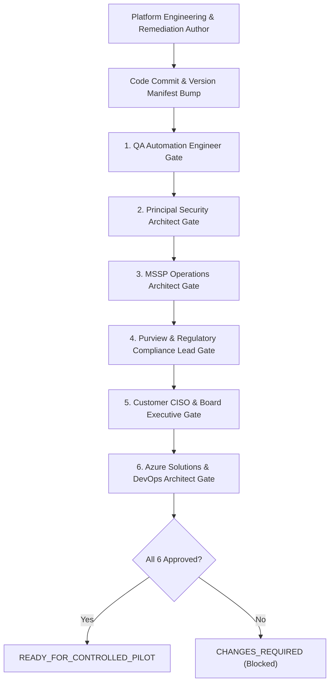

# CloudShield MSSP Platform - Report Review & Release Lifecycle

**Document Version:** 2.0.0  
**Classification:** Quality Governance  

---

## 1. The Anti-Self-Attestation Rule

Under the authoritative CloudShield Governance Standard:
> **The agent or engineer who authors remediation code CANNOT approve its own release.**

Every release candidate requires independent verification and signed approval from six distinct architectural roles:

---

## 2. Review Artifacts
Each reviewer generates an independent evaluation record saved as `AgentReview_<Role>.json` detailing:
- Scope examined
- Formal decision (`CHANGES_REQUIRED` / `APPROVED`)
- Residual risk list
- Mandatory remediation directives
