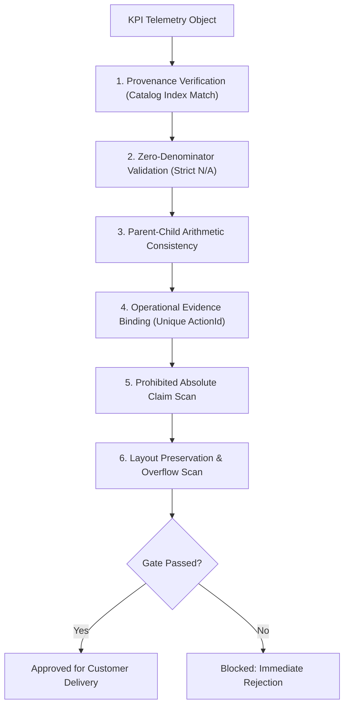

# CloudShield MSSP Platform - Semantic Quality Gate Specifications

**Document Version:** 2.0.0  
**Classification:** Quality Assurance & Automated Testing Standard  

---

## 1. Overview & Gate Workflow

Before any customer report is published or downloaded, it must pass the **Automated Semantic Quality Gate** (`test_report_quality_gate.py` and `test_post_remediation_independent_gate.py`). The gate asserts mathematical, semantic, and regulatory integrity across 14+ failure conditions.

---

## 2. The 14 Semantic Failure Conditions

| Rule # | Semantic Failure Rule | Failure Criteria | Required Output |
| :---: | :--- | :--- | :--- |
| **01** | Zero Denominator Percentage | Denominator is 0, null, or missing, but numeric percentage rendered. | `N/A` |
| **02** | Zero Total with Nonzero Children | Parent total is 0, but breakdown array contains positive counts. | Suppress child rows or emit empty array |
| **03** | Parent-Child Count Discrepancy | Sum of child counts does not equal parent total count. | Strict equality enforced |
| **04** | Percentage Distribution on Zero Total | Percentage breakdown table rendered when total events is 0. | Table suppressed; render zero-state badge |
| **05** | Unbacked Positive FTE | FTE > 0 rendered while approved saved hours is 0 or unbacked. | `0.0 FTE (Kayıt Yok)` |
| **06** | Action Without Approved Evidence | KoçSistem intervention claimed without discrete `ActionId`. | Link to verified activity ticket |
| **07** | Failed Service KPI Rendering | KPI card displayed for a service in `CollectionFailed` state. | Suppress card; disclose in Page 1 health |
| **08** | Empty Table Rendering | HTML `<table>` tag rendered with zero data rows. | Suppress table; render clean notice box |
| **09** | Unloaded Service Omission | Contracted service omitted from Page 1 collection health matrix. | Every contracted service must be listed |
| **10** | Prohibited Absolute Claim | Absolute terms (%100 uyumlu, tam güvence, kusursuz koruma). | Neutral, factual posture terminology |
| **11** | Unqualified Non-Repudiation | Claiming legal non-repudiation based solely on SHA-256 hash. | Qualified technical file integrity disclaimer |
| **12** | Recommendation Without Owner | Strategic recommendation lacking an explicit assigned team. | Owner (SecOps, BT, İK) mandatory |
| **13** | Report Without Decision Section | Report lacking the Four-Quadrant Decision Framework. | All 4 quadrants mandatory |
| **14** | Static Positive Badges on Failed Data | Positive badge (`p-ok`) assigned to `N/A`, `0`, or `Error`. | Dynamic badge: `p-info` or `p-warn` |
