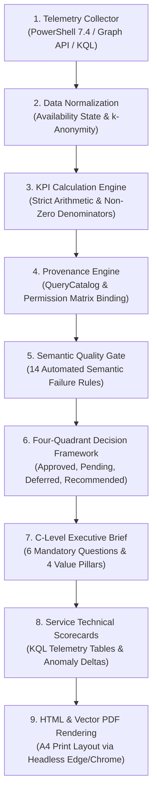

# CloudShield MSSP Platform - Report Generation Lifecycle & Architecture

**Document Version:** 2.0.0  
**Classification:** Core Reporting Architecture  

---

## 1. End-to-End Report Generation Lifecycle

The report compilation pipeline follows an immutable 9-stage progression from raw cloud telemetry to signed A4 vector PDFs:

---

## 2. Dual Output Format Strategy

1. **Interactive HTML (`.html`):**
   - Responsive web preview embedded in the CloudShield MSSP Portal.
   - Preserves complete `data-*` attributes for automated compliance audits.
2. **Vector A4 PDF (`.pdf`):**
   - High-fidelity printable report generated via Chromium `--headless=new --print-to-pdf`.
   - Formatted for boardroom presentation with exact page budgets and vector typography.
