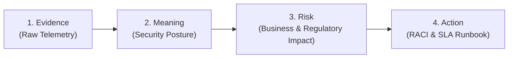

# CloudShield MSSP Platform - Report Storytelling Contract

**Document Version:** 2.0.0  
**Classification:** Reporting Standard  

---

## 1. The Core Principle: Answer "SO WHAT?"

Every visible metric, chart, and scorecard item in a CloudShield report must answer the executive question:
**"SO WHAT? WHY DOES THIS MATTER TO MY BUSINESS?"**

1. If a KPI cannot produce a meaningful insight, **do not display that KPI**.
2. If an insight cannot produce a concrete risk or action, **do not display that insight**.
3. If an action has no identifiable owner, **do not display that action**.

---

## 2. The Four-Stage Storytelling Chain

Every observation follows the immutable progression:
$$\text{Evidence} \longrightarrow \text{Meaning} \longrightarrow \text{Risk} \longrightarrow \text{Action}$$

- **Stage 1 (Evidence):** Concrete telemetry sourced from `DeviceEvents`, `EmailEvents`, `DlpEvents`, or Intune compliance.
- **Stage 2 (Meaning):** Contextualized enterprise significance (e.g. token theft resilience, zero LOLBins exploitation).
- **Stage 3 (Risk):** Regulatory liability (KVKK md. 12 / GDPR Art. 32) and financial exposure.
- **Stage 4 (Action):** Named owner, SLA commitment, and runbook tracking ID (`RB-MDE-GHOST-REMEDIATION`).
