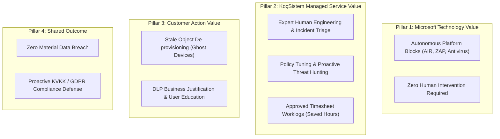

# CloudShield MSSP Platform - Four-Pillar Value Attribution Model

**Document Version:** 2.0.0  
**Classification:** Core Value Model  

---

## 1. The Four Non-Overlapping Pillars

To eliminate customer confusion and prove ROI, CloudShield strictly segregates security outcomes into four non-overlapping pillars:

---

## 2. Microsoft vs. KoçSistem Value Separation Rules

1. **Zero Double-Counting:** Automated Microsoft blocks (e.g., 120 Defender AV blocks) are NEVER counted as KoçSistem human actions.
2. **Evidence-Backed Saved Hours:** KoçSistem saved hours must derive strictly from approved timesheets in `Data/manual-service-activities.json`. Synthetic multipliers (`actions * 1.5`) are prohibited in customer reports.
3. **FTE Capacity Formula:**
   $$\text{FTE} = \frac{\text{ApprovedSavedHours}}{160}$$
   If saved hours are unbacked, the FTE metric must render `0.0 FTE` with an explicit notice: *"Doğrulanmış Süre Kaydı Bulunmuyor"*.
