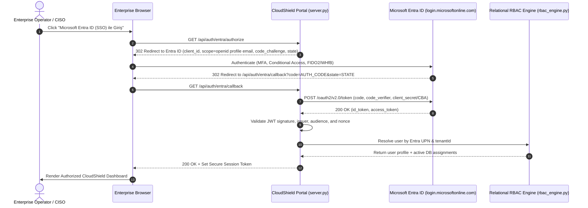

# CloudShield MSSP Platform - Authentication Architecture Specification

**Document Version:** 2.0.0  
**Classification:** Enterprise Identity & Access Management Standard  
**Frameworks:** Microsoft Entra ID (OpenID Connect / OAuth 2.0 / PKCE) + Local Dual-Stack  

---

## 1. Executive Summary

CloudShield Enterprise MSSP operates in multi-tenant enterprise environments requiring robust federated identity, zero trust authentication, and backward-compatible operational agility.

This architecture implements a strict Zero Trust identity model:
1. **Primary Enterprise Provider (Pilot & Production):** Microsoft Entra ID via OpenID Connect (OIDC) with Authorization Code Flow + Proof Key for Code Exchange (PKCE) and federated SSO token exchange (`POST /api/auth/sso`).
2. **Pilot Mode Local Auth Lockout:** When operating in Pilot channel (`CLOUDSHIELD_RELEASE_CHANNEL=pilot`), local password authentication (`POST /api/auth/login`) is strictly disabled at the server level, returning `403 Forbidden` with `"ssoRequired": true`. Local authentication is permitted only in isolated developer environments when explicitly configured via `CLOUDSHIELD_ALLOW_LOCAL_AUTH=true`.
3. **Local Dev / Lab Fallback:** PBKDF2-HMAC-SHA256 salted credentials stored in the relational database, available solely in development environments.

---

## 2. Microsoft Entra ID OIDC + PKCE Flow

---

## 3. Session Security Controls

### 3.1 Token Generation & Cryptography
- **Entropy:** 256-bit cryptographically secure pseudorandom numbers generated via `secrets.token_hex(32)`.
- **Validation:** Every incoming API request validates the Bearer token against server-side session records and cross-checks the user's active status (`users.is_active == 1`).

### 3.2 Session Lifecycle & Revocation
- **Idle Timeout:** 60 minutes of inactivity.
- **Absolute Session Lifetime:** 12 hours max.
- **Immediate Revocation on Logout:** `POST /api/auth/logout` invalidates the server-side session token immediately and logs an audit event.
- **Administrative Revocation:** If an administrator disables a user in `users`, all active sessions are denied on the subsequent request via Stage 1 of the Authorization Decision Chain.

---

## 4. Conditional Access & MFA Enforcement

Because CloudShield integrates with Microsoft Entra ID as an enterprise application:
1. **MFA Enforcement:** Azure Conditional Access policies enforce phishing-resistant MFA (FIDO2, Microsoft Authenticator) before the user receives an authorization code.
2. **Device Compliance:** Intune device compliance checks can restrict portal access to corporate-managed endpoints.
3. **Named Locations:** Azure Conditional Access blocks authentication attempts originating from non-approved geographic regions or anomalous IP ranges.
