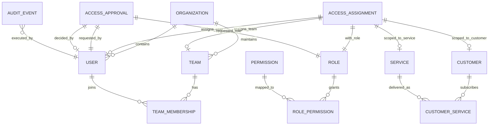

# CloudShield MSSP Platform - Relational RBAC Data Model

**Document Version:** 2.0.0  
**Classification:** Enterprise Security Architecture Specification  
**Database Engine:** SQLite 3 (ACID, Zero External Dependencies)  
**Schema Migration:** `database/migrations/001_initial_rbac_schema.sql`  

---

## 1. Overview & Architectural Principles

The CloudShield Authorization Engine utilizes a relational data model designed to enforce **deny-by-default**, **two-dimensional access scoping** (Customer Scope × Service Scope), **Separation of Duties (SoD)**, and **tamper-evident auditability**.

### Key Architectural Tenets
1. **Server-Side Exclusivity:** All role, permission, customer, and service assignments are stored and evaluated in the relational database layer.
2. **Multi-Tenant Boundary:** Access assignments explicitly delineate between `ALL` customers (global administrative scope) and specific tenant identifiers.
3. **Service Scoping:** Users are assigned explicit service scopes (`ALL` or specific `ServiceId`), ensuring an EDR engineer cannot access Purview DLP or Insider Risk records.
4. **Time-Bounded & JIT Ready:** Every assignment supports optional `valid_from` and `valid_to` timestamps with CloudShield JIT Temporary Access Elevation workflow tracking (compatible with Microsoft Entra PIM zero standing access principles).
5. **Least Privilege for Administrative Roles:** Administrative roles (`PlatformAdmin`) are strictly restricted from automatic access to customer confidential data (reports). Platform administrators must hold explicit customer assignments or approved CloudShield JIT Temporary Access Elevation to view or generate customer reports.
6. **Separation of Duties (SoD):** The engineer who creates/triggers a report is cryptographically prohibited from approving that report.

---

## 2. Entity Relationship Diagram (ERD)

---

## 3. Relational Table Specifications

### 3.1 `organizations`
Represents the root MSSP organization hosting the platform.
- `id` (TEXT, PK): Unique organization ID (`org-kocsistem`).
- `name` (TEXT): Enterprise display name (`KoçSistem MSSP Platform`).
- `domain` (TEXT): Enterprise domain (`kocsistem.com.tr`).
- `created_at` (TEXT): ISO 8601 creation timestamp.

### 3.2 `users`
System identities capable of authenticating to the platform.
- `id` (TEXT, PK): User ID (`usr-admin`, `usr-001`).
- `organization_id` (TEXT, FK): Parent organization.
- `upn` (TEXT, UNIQUE): User Principal Name / Email.
- `display_name` (TEXT): Full personal name.
- `email` (TEXT): Notification and alert email.
- `department` (TEXT): Organizational unit.
- `password_hash` (TEXT): PBKDF2-HMAC-SHA256 hash (100,000 iterations).
- `password_salt` (TEXT): 16-byte random hex salt.
- `is_active` (INTEGER): `1` for active, `0` for disabled (immediately blocks all access).
- `is_mfa_enabled` (INTEGER): `1` if multi-factor authentication is active.
- `auth_provider` (TEXT): `Local` or `EntraID_OIDC`.
- `last_login_at` (TEXT): ISO 8601 timestamp.
- `created_at` (TEXT): ISO 8601 timestamp.

### 3.3 `teams` & `team_memberships`
Operational engineering teams (e.g. Core EDR Squad, Purview Compliance Squad).
- Supports group-based access assignments where all team members inherit assigned roles and scopes.

### 3.4 `customers`
Enterprise clients and cloud tenants managed by the MSSP.
- `id` (TEXT, PK): Customer identifier (`tenant-002`).
- `tenant_id` (TEXT, UNIQUE): Microsoft Entra ID Directory GUID.
- `name` (TEXT): Customer corporate name (`Emre-TestTenant`).
- `contact_email` (TEXT): Primary executive contact email.
- `report_mode` (TEXT): Default report type (`Consolidated`, `SingleService`).
- `selected_package` (TEXT): Subscribed tier (`PKG-10`).
- `connection_status` (TEXT): `LiveConnected`, `Connecting`, `Error`.
- `health_status` (TEXT): `Healthy`, `Warning`, `Degraded`.
- `secure_score` (REAL): Current customer Microsoft Secure Score.
- `created_at` (TEXT): Onboarding timestamp.

### 3.5 `services` & `customer_services`
The 12 enterprise managed security and Purview services.
- `services`: `id`, `code` (`SVC-MDE`, `SVC-PRV-DLP`), `name_tr`, `name_en`, `category`, `product_family`, `plugin_folder`, `is_active`.
- `customer_services`: Association table defining customer service subscription:
  - `service_level`: `MonitoringOnly`, `MonitoringAndReporting`, `Managed`, `ManagedAndResponse`, `Advisory`.
  - `status`: `Onboarded`, `Suspended`, `Disabled`.
  - `onboarded_at`, `updated_at`: Lifecycle timestamps.

### 3.6 `roles`, `permissions` & `role_permissions`
Granular privilege mapping.
- **Roles:** `PlatformAdmin`, `SecurityEngineer`, `ComplianceSpecialist`, `CustomerCISO`, `Auditor`, `ServiceOperator`.
- **Permissions:** 21 discrete action codes spanning `reports`, `customers`, `services`, `matrix`, `teams`, `roles`, `assignments`, `approvals`, `audit`, and `simulator`.

### 3.7 `access_assignments`
The core binding entity for authorization decisions.
- `subject_type` (TEXT): `User` or `Team`.
- `subject_id` (TEXT): Foreign key to `users.id` or `teams.id`.
- `role_id` (TEXT, FK): Assigned role.
- `customer_scope` (TEXT): `ALL` or `Specific`.
- `customer_id` (TEXT, NULLABLE): Target customer when `Specific`.
- `service_scope` (TEXT): `ALL` or `Specific`.
- `service_id` (TEXT, NULLABLE): Target service code/id when `Specific`.
- `valid_from` (TEXT): Effective start time.
- `valid_to` (TEXT, NULLABLE): Expiry time (if temporary).
- `is_temporary` (INTEGER): JIT temporary elevation indicator (`1` for time-bounded elevation, `0` for standing assignment).
- `is_active` (INTEGER): Administrative enable/disable switch.
- `approval_id` (TEXT, NULLABLE): Linked CloudShield JIT approval record.

### 3.8 `access_approvals`
CloudShield JIT Temporary Access Elevation requests and approvals (compatible with Microsoft Entra PIM principles).
- `requester_id`, `approver_id`, `requested_role_id`, `customer_id`, `service_id`, `duration_hours`, `reason`, `status` (`Pending`, `Approved`, `Rejected`, `Expired`), `decision_reason`, `created_at`, `decided_at`.

### 3.9 `audit_events`
Immutable record of all authorization evaluations and administrative changes.
- `id`, `timestamp`, `event_type`, `user_id`, `user_upn`, `customer_id`, `service_id`, `resource`, `decision` (`ALLOW` / `DENY`), `reason`, `ip_address`, `details_json`.

---

## 4. Migration & Backward Compatibility
The database migration script `001_initial_rbac_schema.sql` automatically runs idempotently upon startup. Existing records from `Data/tenants.json` and `Data/users.json` are seeded automatically, mapping legacy roles and assigned tenants into relational `access_assignments`.
