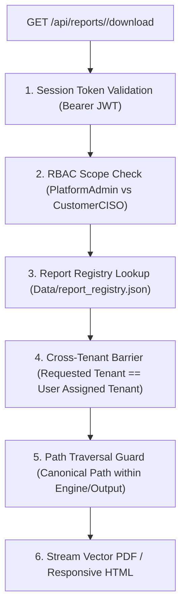

# CloudShield MSSP Platform - Report Artifact Authorization & Download ACL

**Document Version:** 2.0.0  
**Classification:** Application Security Architecture  

---

## 1. Multi-Tenant Download Protection

Report downloads (`GET /api/reports/download` or `GET /api/reports/<id>/download`) enforce strict multi-tenant authorization guardrails:

### Security Guardrails:
1. **Zero Path Traversal:** Filepaths are resolved via `os.path.realpath` and strictly asserted to reside within `Engine/Output/`. Attempts to traverse (`../`) are blocked with HTTP 403.
2. **Tenant Barrier:** Customer viewers (`CustomerViewer`, `CustomerCISO`) can ONLY download reports belonging to their explicitly assigned tenant ID.
